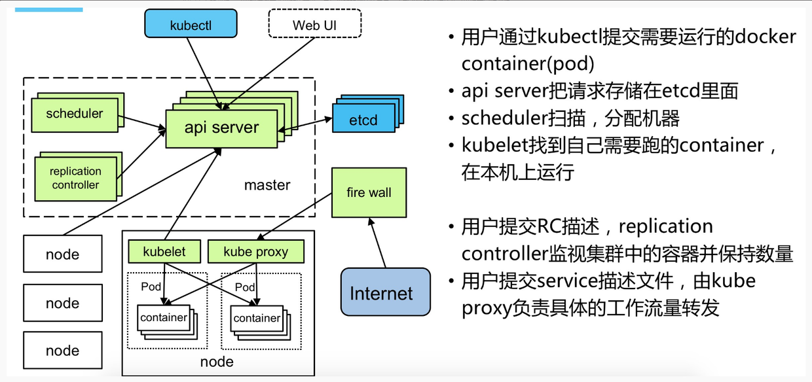
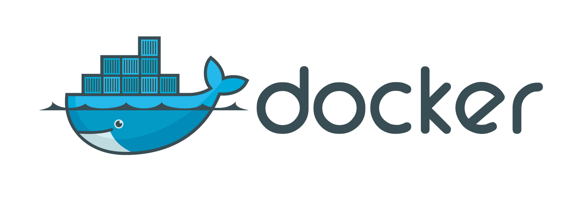
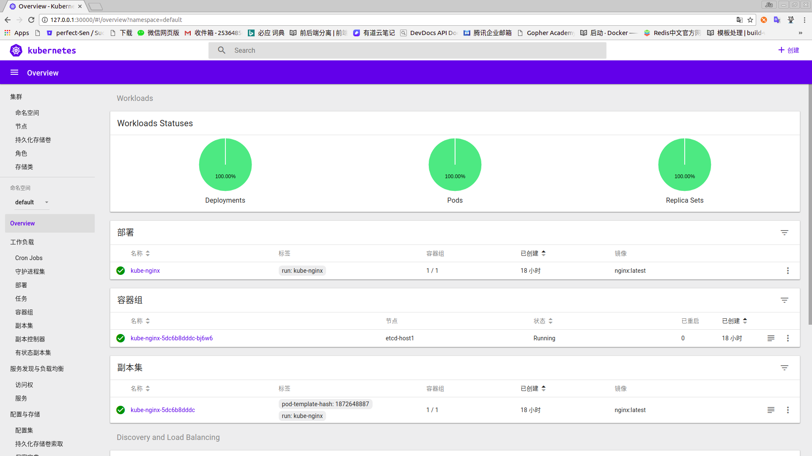

#### kubernetes-tutorial 

<p align="center">

</p>

#### 搭建本地kubernetes集群

Kubernetes是Google开源的一个容器集群管理系统，用于管理云平台中多个主机上的容器化的应用。Kubernetes的目标是让部署容器化的应用简单并且高效（powerful）,Kubernetes提供了应用部署，规划，更新，维护的一种机制。

Kubernetes中的一个核心的特点就是能够自主的管理容器来保证云平台中的容器按照用户的期望状态运行着（比如用户想让一个服务稳定运行，用户不需要关心怎么去做，Kubernetes会自动去监控，然后去重启，新建等操作，让服务始终稳定运行），管理员可以加载一个微型服务，让规划器来找到合适的位置，同时Kubernetes系统提升工具以及人性化方面，让用户能够方便的部署自己的应用（就像canary deployments）。

Kubernetes是为生产环境而设计的容器调度管理系统，对于负载均衡、服务发现、高可用、滚动升级、自动伸缩等容器云平台的功能要求有原生支持。

<p align="center">

</p>

Kubernetes集群是由分布式存储（etcd）、服务节点（Minion，etcd现在称为Node）和控制节点（Master）构成的。所有的集群状态都保存在etcd中，Master节点上则运行集群的管理控制模块。Node节点是真正运行应用容器的主机节点，在每个Minion节点上都会运行一个Kubelet代理，控制该节点上的容器、镜像和存储卷等。

首先我们先来了解下Kubernetes中的组件：

1. Cluster: 集群是指由Kubernetes使用一系列的物理机、虚拟机和其他基础资源来运行你的应用程序。
2. Node:一个node就是一个运行着Kubernetes的物理机或虚拟机，并且pod可以在其上面被调度。
3. Pod: 一个pod对应一个由相关容器和卷组成的容器组。
4. Label: 一个label是一个被附加到资源上的键/值对，譬如附加到一个Pod上，为它传递一个用户自定的并且可识别的属性.Label还可以被应用来组织和选择子网中的资源。
5. selector是一个通过匹配labels来定义资源之间关系得表达式，例如为一个负载均衡的service指定所目标Pod。
6. Replication Controller: replication controller 是为了保证一定数量被指定的Pod的复制品在任何时间都能正常工作.它不仅允许复制的系统易于扩展，还会处理当pod在机器在重启或发生故障的时候再次创建一个。
7. Service: 一个service定义了访问pod的方式，就像单个固定的IP地址和与其相对应的DNS名之间的关系。
8. Volume: 一个volume是一个目录，可能会被容器作为未见系统的一部分来访问。Kubernetes volume 构建在Docker Volumes之上,并且支持添加和配置volume目录或者其他存储设备。
9. Secret: Secret 存储了敏感数据，例如能允许容器接收请求的权限令牌。
10. Name: 用户为Kubernetes中资源定义的名字。
11. Namespace: Namespace 好比一个资源名字的前缀。它帮助不同的项目、团队或是客户可以共享cluster,例如防止相互独立的团队间出现命名冲突。
12. Annotation: 相对于label来说可以容纳更大的键值对，它对我们来说可能是不可读的数据，只是为了存储不可识别的辅助数据，尤其是一些被工具或系统扩展用来操作的数据。

#### 搭建目录

* [安装Docker](#安装Docker)
* [Docker命令详解](https://github.com/KeKe-Li/docker-directive/blob/master/README.md)
* [安装Minikube](#安装Minikube)
* [安装Kubectl](#安装Kubectl)
* [启动minikube](#启动minikube)
* [启动容器服务](#启动容器服务)
* [检查状态](#查看状态)
* [重新启动服务](#重新启动服务)
* [发布服务](#发布服务)
* [启动dashboard管理后台](#启动dashboard管理后台)
* [重启minikube](#重启minikube)
* [科学上网](#科学上网)
* [Services](https://github.com/KeKe-Li/kubernetes-tutorial/blob/master/src/service/service.md)
* [Pods](https://github.com/KeKe-Li/kubernetes-tutorial/blob/master/src/pod/pods.md)
* [Arrange](https://github.com/KeKe-Li/kubernetes-tutorial/blob/master/src/service/arrange.md)
* [Drone配置](https://github.com/KeKe-Li/kubernetes-tutorial/blob/master/src/drone/drone.md)
* [kubectl](https://github.com/KeKe-Li/kubernetes-tutorial/blob/master/src/kubectl/kubectl.md)
* [kubernetes组件和架构](https://github.com/KeKe-Li/kubernetes-tutorial/blob/master/src/pod/pods-arrange.md)
* [kubernetes安装运行Istio应用](https://github.com/KeKe-Li/kubernetes-tutorial/blob/master/src/istio/istio.md)
* [kubernetes-cluster集群搭建](https://github.com/KeKe-Li/kubernetes-tutorial/blob/master/src/cluster/kubernetes-cluster.md)
* [kubernetes集群手动更新版本](https://github.com/KeKe-Li/kubernetes-tutorial/blob/master/src/update/update.md)

#### 安装Docker 

<p align="center">

</p>

Docker在2016年很早的时候就明确了将会在企业级方面重点跟进。而在短短的一年时间之内推出的1.12和1.13的版本在功能上确实是很大的进步。而在2017年的3月1号之后，Docker的版本命名开始发生变化，同时将CE版本和EE版本进行分开，而这些也是突然发现docker1.13的安装脚本不好用了才发现的，一起简单来看一下具体情况吧。

但是Docker企业版(EE)和Docker社区版(CE)版本有何不同呢？

* Docker CE是简单的经典OSS Docker引擎。

Docker Engine已经重新命名为`Docker Community Edition`，顾名思义，这是一个自己动手的，社区支持的Docker版本，免费提供。
社区版将提供两个版本：Edge和Stable。 Edge将会每月发布最新的function。 稳定将按季度发布。 虽然Edge将会收到针对当前版本的安全更新和错误修复，但稳定版本将在初始版本发布后的四个月内得到类似的更新。 此更新周期将为用户提供足够大的窗口来计划从旧版本升级。

虽然这两个版本都针对不同的受众，但在源代码级别上没有太大的差别。 墨西拿说：“Docker EE和CE都是基于开放源码的Docker项目，Docker项目是由Docker的合作伙伴和贡献者共同开发的，这就形成了所有Docker CE和EE版本的开放模块化核心。

* Docker还提供了一个authentication计划来帮助第三方供应商确保他们的产品与Docker EE一起工作。

Docker企业版有三个版本：基本版，标准版和高级版。 基本版附带Docker平台，支持和authentication，而标准版和高级版则增加了附加function，如容器pipe理（Docker Datacenter）和Docker安全扫描。

Docker EE由阿里巴巴，Canonical，HPE，IBM，Microsoft和区域合作伙伴networking提供支持。 那些想testingDocker EE的人可以从官方网站免费下载试用版。Docker还提供了一个authentication计划来帮助第三方供应商确保他们的产品与Docker EE一起工作。Docker EE是Docker CE，在某些系统上获得authentication，并由Docker Inc.提供支持。

<p align="center">

</p>

实际上Docker从17.03开始分为企业版与社区版，社区版并非阉割版，而是改了个名称；企业版则提供了一些收费的高级特性。EE版本维护期1年；CE的stable版本三个月发布一次，维护期四个月；另外CE还有edge版，一个月发布一次。个人用社区版开发完全可以满足开发要求！

首先安装docker环境，这个可以根据电脑系统的不同，选择不同的安装方式。

* [Mac安装](https://docs.docker.com/docker-for-mac/install/)
* [Ubantu安装](https://docs.docker.com/install/linux/docker-ce/ubuntu/)
* [Windows安装](https://docs.docker.com/docker-for-windows/install/)
* [centos安装](https://docs.docker.com/install/linux/docker-ce/centos/)

#### 安装Minikube

MiniKube 是使用 Go 语言开发的，所以安装其实很方便，一是通过下载基于不同平台早已编译好的二级制文件安装，二是可以编译源文件安装。

* Mac安装
```bash
# 如未安装cask，自行搜索 brew安装cask
> brew cask install minikube

> minikube -h
```

* Linux 安装
```bash
# 下载v0.24.1版本
> curl -Lo minikube https://storage.googleapis.com/minikube/releases/v0.24.1/minikube-linux-amd64 && chmod +x minikube && sudo mv minikube /usr/local/bin/

# 也可以下载最新版
> curl -Lo minikube https://storage.googleapis.com/minikube/releases/latest/minikube-linux-amd64 && chmod +x minikube && sudo mv minikube /usr/local/bin/

> minikube -h
```
#### 安装Kubectl

kubernetes通过 `kube-apiserver` 作为整个集群管理的入口。Apiserver是整个集群的主管理节点，用户通过Apiserver配置和组织集群，同时集群中各个节点同etcd存储的交互也是通过Apiserver进行交互。Apiserver实现了一套RESTfull的接口，用户可以直接使用API同Apiserver交互。但是官方提供了一个客户端kubectl随工具集打包，用于可直接通过kubectl以命令行的方式同集群交互。

因而kubectl是一个用于操作kubernetes集群的命令行接口,通过利用kubectl的各种命令可以实现各种功能,是在使用kubernetes中非常常用的工具。

```bash
> curl -Lo kubectl https://storage.googleapis.com/kubernetes-release/release/$(curl -s https://storage.googleapis.com/kubernetes-release/release/stable.txt)/bin/linux/amd64/kubectl && chmod +x kubectl && sudo mv kubectl /usr/local/bin/

> kubectl -h
```

#### 启动minikube

```bash
> sudo minikube start
```
首次启动会下载localkube，下载过程可能会失败，会有如下提示，

```bash
Starting local Kubernetes v1.8.0 cluster...
Starting VM...
Downloading Minikube ISO
 60.70 MB / 110.01 MB [====================>-----------------------]  46.21% 14s
E0106 14:06:03.884826   10434 start.go:150] Error starting host: Error attempting to cache minikube ISO from URL: Error downloading Minikube ISO: failed to download: failed to download to temp file: failed to copy contents: read tcp 10.0.2.15:47048->172.217.24.16:443: read: connection reset by peer.

================================================================================
An error has occurred. Would you like to opt in to sending anonymized crash
information to minikube to help prevent future errors?
To opt out of these messages, run the command:
    minikube config set WantReportErrorPrompt false
================================================================================
Please enter your response [Y/n]:
```
这个过程中如果下载成功，但是报了诸如VBoxManage not found这样的错误：

```bash
Starting local Kubernetes v1.8.0 cluster...
Starting VM...
Downloading Minikube ISO
 140.01 MB / 140.01 MB [============================================] 100.00% 0s
E0106 11:10:00.035369   10474 start.go:150] Error starting host: Error creating host: Error executing step: Running precreate checks.
: VBoxManage not found. Make sure VirtualBox is installed and VBoxManage is in the path.

 Retrying.
E0106 14:10:00.035780   10474 start.go:156] Error starting host:  Error creating host: Error executing step: Running precreate checks.
: VBoxManage not found. Make sure VirtualBox is installed and VBoxManage is in the path
================================================================================
An error has occurred. Would you like to opt in to sending anonymized crash
information to minikube to help prevent future errors?
To opt out of these messages, run the command:
    minikube config set WantReportErrorPrompt false
================================================================================
Please enter your response [Y/n]:
```
出了这样的问题的解决办法是安装 VirtualBox（用windows或者mac）再重新启动，但是如果你是Linux，也可以执行如下命令启动minikube，此时就不需要安装VirtualBox了。

minikube默认需要虚拟机来初始化kunernetes环境，但是使用Linux系统的用户是不需要的，可以在minikube start后追加–vm-driver=none参数来使用自己的环境。

```bash
# linux 下独有，不依赖虚拟机启动
> sudo minikube delete
> sudo minikube start --vm-driver=none

# 如果是Mac or Windows，安装VirtualBox后再重新start即可
> sudo minikube start
```
如果你安装了虚拟机，或者你在Linux下使用了minikube start --vm-driver=none，并且下载完毕，会有如下提示运行成功

```bash
Starting local Kubernetes v1.8.0 cluster...
Starting VM...
Getting VM IP address...
Moving files into cluster...
Downloading localkube binary
 148.25 MB / 148.25 MB [============================================] 100.00% 0s
 0 B / 65 B [----------------------------------------------------------]   0.00%
 65 B / 65 B [======================================================] 100.00% 0sSetting up certs...
Connecting to cluster...
Setting up kubeconfig...
Starting cluster components...
Kubectl is now configured to use the cluster.
===================
WARNING: IT IS RECOMMENDED NOT TO RUN THE NONE DRIVER ON PERSONAL WORKSTATIONS
    The 'none' driver will run an insecure kubernetes apiserver as root that may leave the host vulnerable to CSRF attacks

When using the none driver, the kubectl config and credentials generated will be root owned and will appear in the root home directory.
You will need to move the files to the appropriate location and then set the correct permissions.  An example of this is below:

    sudo mv /root/.kube $HOME/.kube # this will write over any previous configuration
    sudo chown -R $USER $HOME/.kube
    sudo chgrp -R $USER $HOME/.kube

    sudo mv /root/.minikube $HOME/.minikube # this will write over any previous configuration
    sudo chown -R $USER $HOME/.minikube
    sudo chgrp -R $USER $HOME/.minikube

This can also be done automatically by setting the env var CHANGE_MINIKUBE_NONE_USER=true
Loading cached images from config file.
```
#### 启动容器服务

```bash
# kube-nginx是要定义的容器名称 nginx:latest表明要用nginx镜像 --port=80表明容器对外暴露80端口
> sudo kubectl run kube-nginx --image=nginx:latest --port=80

deployment "kube-nginx" created
```
#### 检查状态

```bash
> sudo kubectl get pods

NAME                            READY     STATUS    RESTARTS   AGE
kube-nginx-5dc6b8dddc-bj6w6     0/1       Running   0          29s
```

如果你的服务一直是containerCreating状态，没有变化，那就是创建实例出现问题，直接查看log日志。

```bash 
> sudo minikube logs
```

日志中出现 failed pulling image… 则是因为镜像拉取失败导致服务创建失败，可能是因为墙的问题！

```bash
2月 28 11:16:42 etcd-host1 localkube[21771]: E0228 11:16:42.817937   21771 remote_image.go:108] PullImage "gcr.io/google-containers/kube-addon-manager:v6.4-beta.2" from image service failed: rpc error: code = Unknown desc = Error response from daemon: Get https://gcr.io/v2/: net/http: request canceled while waiting for connection (Client.Timeout exceeded while awaiting headers)
2月 28 11:16:42 etcd-host1 localkube[21771]: E0228 11:16:42.818010   21771 kuberuntime_image.go:50] Pull image "gcr.io/google-containers/kube-addon-manager:v6.4-beta.2" failed: rpc error: code = Unknown desc = Error response from daemon: Get https://gcr.io/v2/: net/http: request canceled while waiting for connection (Client.Timeout exceeded while awaiting headers)
```
解决的方法就是用本地镜像去替代

```bash
# 下载阿里云镜像
> docker pull registry.cn-hangzhou.aliyuncs.com/google-containers/pause-amd64:3.0

# 本地命名为 gcr.io/google_containers/pause-amd64:3.0
> docker tag registry.cn-hangzhou.aliyuncs.com/google-containers/pause-amd64:3.0 gcr.io/google_containers/pause-amd64:3.0
```
查看状态

```bash
> sudo minikube status

minikube: Running
cluster: Running
kubectl: Correctly Configured: pointing to minikube-vm at 127.0.0.1
```
#### 重新启动服务

这里我增加了 –image-pull-policy=IfNotPresent 参数，这个表明优先使用本地镜像，不从远端拉取.

```bash
> sudo kubectl run kube-nginx --image=nginx:latest --port=80 --image-pull-policy=IfNotPresent
```
如果提示已经存在，换个名字重新执行。这时候查看服务状态应该是如下Running状态代表创建成功，但此时还不能访问容器。

```bash
 NAMESPACE       NAME                            READY     STATUS    RESTARTS   AGE
 default         kube-nginx-5dc6b8dddc-bj6w6     1/1       Running   0          29s
```

#### 发布服务

```bash
> sudo kubectl expose deployment kube-nginx --type=NodePort
service "kube-nginx" exposed
```

#### 服务地址

```bash
> sudo minikube service kube-nginx --url
http://127.0.0.1:31511
```
这里展示的地址即启动的nginx容器服务地址，访问http://127.0.0.1:31511 于是便出现nginx首页，服务成功启动.

#### 启动dashboard管理后台
dashboard是kubernetes提供的容器服务管理后台，可视化界面，用来进行机器负载，集群管理，镜像扩容，配置数据等相关操作

启动dashboard
```bash
# 打印出管理后台地址
> sudo minikube dashboard --url

# 用下面写法，会自动打开默认浏览器
> sudo minikube dashboard
```
如果初次可能会报下面的两种错误之一：
```bash
# 第一种错误
Could not find finalized endpoint being pointed to by kubernetes-dashboard: Error validating service: Error getting service kubernetes-dashboard: services "Kubernetes" not found

# 第二种错误
Waiting, endpoint for service is not ready yet...
Waiting, endpoint for service is not ready yet...
```
仔细查看log，你就会找到错误的原因，因为镜像拉取的时候便失败了。
解决方法如下，将所有kubernetes需要的镜像全部用阿里源下载到本地，然后命名为gcr.io…，以便minikube不从远端去下载。

如果你不确定应该将tag重命名为什么的话，可以执行sudo grep ‘image’ -R /etc/kubernetes看到默认情况下需要的镜像名以及版本号，你可以去[阿里云镜像](https://dev.aliyun.com/search.html)搜索下载，然后命名为上面配置中定义的tag即可，你也可以在阿里云下载1.2然后重命名为1.3。

```bash
> docker pull registry.cn-hangzhou.aliyuncs.com/google-containers/kubernetes-dashboard-amd64:v1.7.1
docker tag registry.cn-hangzhou.aliyuncs.com/google-containers/kubernetes-dashboard-amd64:v1.7.1 gcr.io/google_containers/kubernetes-dashboard-amd64:v1.8.0

> docker pull registry.cn-hangzhou.aliyuncs.com/google_containers/kube-addon-manager:v6.4-beta.2
docker tag registry.cn-hangzhou.aliyuncs.com/google_containers/kube-addon-manager:v6.4-beta.2 gcr.io/google-containers/kube-addon-manager:v6.4-beta.2

> docker pull registry.cn-shenzhen.aliyuncs.com/gcrio/k8s-dns-kube-dns-amd64:latest
docker tag registry.cn-shenzhen.aliyuncs.com/gcrio/k8s-dns-kube-dns-amd64:latest gcr.io/google_containers/k8s-dns-kube-dns-amd64:1.14.5

> docker pull registry.cn-hangzhou.aliyuncs.com/google-containers/k8s-dns-dnsmasq-nanny-amd64:1.14.5
docker tag registry.cn-hangzhou.aliyuncs.com/google-containers/k8s-dns-dnsmasq-nanny-amd64:1.14.5 gcr.io/google_containers/k8s-dns-dnsmasq-nanny-amd64:1.14.5

> docker pull registry.cn-hangzhou.aliyuncs.com/google-containers/k8s-dns-sidecar-amd64:1.14.5
docker tag registry.cn-hangzhou.aliyuncs.com/google-containers/k8s-dns-sidecar-amd64:1.14.5 gcr.io/google_containers/k8s-dns-sidecar-amd64:1.14.5

> docker pull registry.cn-hangzhou.aliyuncs.com/google_containers/storage-provisioner:v1.8.1
docker tag registry.cn-hangzhou.aliyuncs.com/google_containers/storage-provisioner:v1.8.1 gcr.io/k8s-minikube/storage-provisioner:v1.8.1
```

#### 重启minikube
```bash
> sudo minikube stop
> sudo minikube start [--vm-driver=none] # linux没装virtualbox的情况下需要加上后面的参数
Starting local Kubernetes v1.8.0 cluster...
Starting VM...
Getting VM IP address...
Moving files into cluster...
Setting up certs...
Connecting to cluster...
Setting up kubeconfig...
Starting cluster components...
Kubectl is now configured to use the cluster.
Loading cached images from config file.
```
然后执行

```bash
> sudo minikube dashboard --url

http://127.0.0.1:30000/
```
直接访问，便可以看到kubernetes的dashboard后台。

<p align="center">

</p>

#### 科学上网
如果你下载时提示下载错误，基本上是墙的问题，所以科学上网很重要，你也可以在终端里执行下面命令，让curl wget等命令也会走代理，快速下载.
```bash
> export http_proxy='socks5:127.0.0.1:1003'
```

#### kubernetes集群

觉得此文章不错，支持我的话可以给我star,:star:！如果有问题也可以直接给我提issues,我会及时回复的.

License
This is free software distributed under the terms of the MIT license
