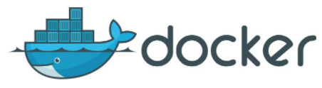
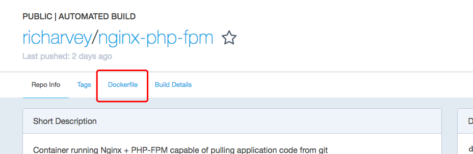
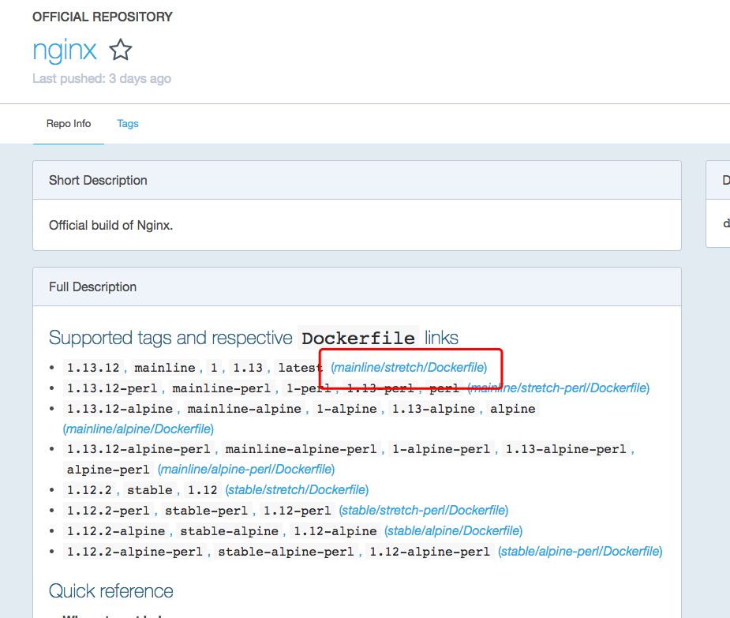

#### Dockerfile构建镜像

<p align="center">

</p>
什么是docker?

Docker官方给出的定义是:Docker是一个能够把开发的应用程序自动部署到容器的开源引擎。由 Docker Inc. 公司 前 dotC1oud公司, PaaS市场中的提供商)的团队编写,基于 Apache 2.0开源授权协议发行。

Docker是一个开源的应用容器引擎,它将应用程序与该程序的依赖包，打包到一个文件里面。当开发者运行这个文件的时候，就会对应生成一个虚拟容器。程序在这个虚拟容器里运行，就好像在真实的物理机上运行一样。因此有了Docker，开发者就不用担心环境问题,用户操作 Docker 的容器就像操作一个快速轻量级的虚拟机一样简单方便。

Docker的基础是Linux容器(XLC),有了Docker容器之后,开发者就不用在担心因为本地环境和线上环境不一致导致项目发布出问题的状况。Docker提供简单易用的容器使用接口,用户可以方便创建和使用容器,也可以对容器进行版本管理和复制,修改等,使部署应用更加简单方便。


dokcer容器化开发可以加速本地开发和构建，开发人员可以构建、运行并分享Docker容器，容器可以在开发环境中构建，然后轻松地提交到测试环境中，并最终进入生产环境.

* [Docker官网](https://github.com/moby/moby)
* [Docker命令详解](https://github.com/KeKe-Li/docker-directive)

#### 1.DockerFile介绍

以hub.docker中的项目来说,一般作者都会存放这个image对应的Dockerfile,我们也可以直接使用Dockerfile来生成自己的nginx镜像

<p align="center">

</p>

<p align="center">

</p>

#### 2.编译自己的nginx

Dockerfile可以基于任何镜像的技术上搭建环境,可以基于别人做好的镜像比如Nginx,也可以基于基础镜像比如centos等,这里基于nginx镜像构建出本地的nginx:local并且运行镜像不在启动nginx只是输出一条nginx

```
> vim Dockerfile
FROM nginx:1.13.12
CMD ["echo", "nginx"]

> docker build -t nginx:local .
> docker images
REPOSITORY                                                          TAG                 IMAGE ID            CREATED             SIZE
nginx                                                               local               6ea964efbbc8        10 seconds ago      109 MB

> docker run -it nginx:local
> docker run -it nginx:local
nginx
```


#### 3.Dockerfile 语法

使用以下的语法可以实现各种各样的镜像

```Docker
- FROM：指定父镜像，可以通过添加多个FROM，在同一个Dockerfile中创建多个镜像
- MAINTAINER：维护者信息，可选
- RUN：用来修改镜像的命令，可以用来安装程序，当一条RUN完成后，会在当前的镜像上创建一个新的镜像层，接下来的指令会在新的镜像层上执行。有2种形式。 
	- RUN [“apt-get”, “update”]，调用exec
	- RUN apt-get update,调用的/bin/sh
- EXPOSE：用来指明容器内进程对外开放的端口。在docker run的时候可以加-p（可以将EXPOSE中没列出的端口设置为对外开放）和-P（EXPOSE里所指定的端口映射到主机上另外的随机端口？？？）来设置端口。
- ADD：向新容器中添加文件,文件可以是 
	- 主机文件：必须是相对Dockerfile所在目录的相对路径（如果是压缩文件，docker会解压缩）
	- 网络文件：URL文件，在创建容器时会下载下来添加到镜像中。（如果是压缩文件，docker不会解压缩）
	- 目录：必须是相对Dockerfile所在目录的相对路径（如果是压缩文件，docker会解压缩）
- COPY: 与ADD的区别是COPY的<src>只能是本地文件，其他用法一致
- VOLUME：会在镜像里创建一个指定路径的挂载点。这个路径可以来自主机，也可以来自其他容器，多个容器通过同一个挂载点来共享数据，即便有个容器已经停止，其余容器还是可以访问挂载点，只有当挂载点所有的容器引用消失，挂载点才会自动删除。
- WORKDIR：为接下来的指令指定一个新的工作目录。当启动一个容器后，最后一条WORKDIR指令所指向的目录为容器当前运行的工作目录。
- ENV：设置环境变量，在docker run 时可以用-e来设置环境变量docker run -e WEBAPP_PORT=8000 -e WEBAPP_HOST=www.example.com
- CMD：设置容器运行时默认运行的命令，CMD参数格式与RUN类似。CMD ls -l -a 或CMD ["ls", "-l", "-a"]
- ENTRYPOIN：与CMD类似，指定容器运行时默认命令。ENTRYPOINT和CMD的区别，在于运行容器时，镜像后的命令参数，ENTRYPOINT是拼接，CMD是覆盖
- USER：为容器的运行和RUN CMD ENTRYPOINT等指令的运行 指定用户或者UID
- ONBUILD：触发器指令，父镜像中不会执行，只有在子镜像中才会执行。 
```


