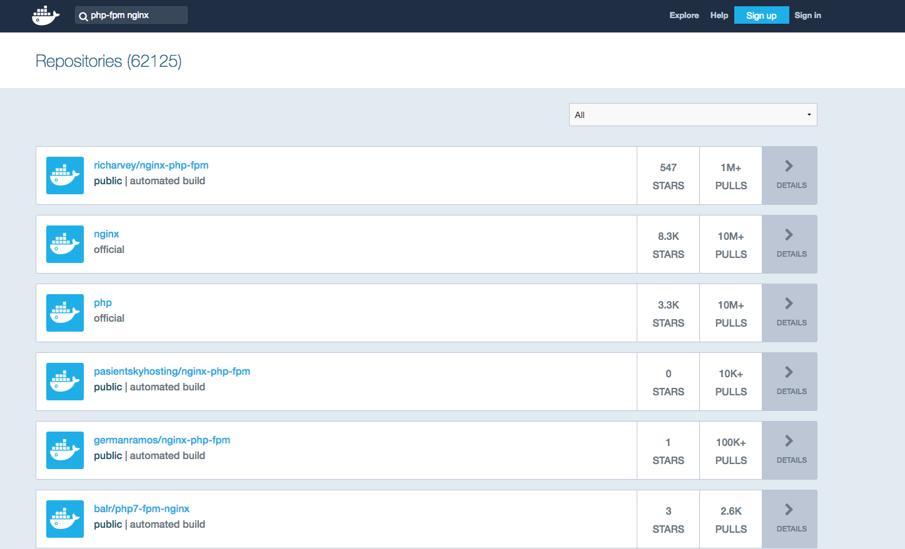
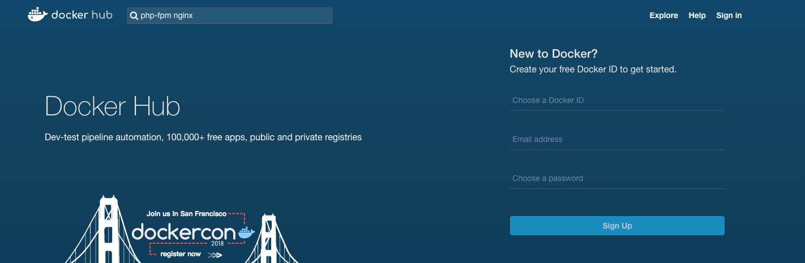

####  Docker使用命令和技巧

<p align="center">

</p>

#### docker容器生命周期管理

- docker run 在一个新的容器执行一个命令
- docker start 开一个或者更多已经停止的容器
- docker stop 停止一个运行的容器
- docker restart 重新开始一个运行的容器
- docker kill 杀死一个运行的容器
- docker rm 删除一个或更多的容器
- docker pause 暂停一个容器的所有进程
- docker unpaunse 恢复一个容器的所有进程

#### docker容器操作运维

- docker ps 列出容器
- docker inspect 列出关于容器或镜像的底层信息
- docker top 显示一个容器运行的进程
- docker attach 附上一个运行的容器
- docker events 得到实时的来自服务的事件
- docker log 获得一个容器的日志
- docker wait 阻塞直到一个容器停止，然后打印它的退出代码
- docker export 导出一个容器的文件系统作为一个tar文件
- docker port 列出容器映射的端口

#### docker版本管理

- docker commit 创建一个新的镜像从一个容器
- docker cp 从容器复制一个文件或目录到本地目录或标准输出
- docker diff 展示一个容器文件系统的变化

#### docker镜像仓库

- docker login 登入仓库
- docker pull 拉取镜像
- docker push 推送镜像
- docker search 搜索镜像

#### docker本地镜像管理

- docker images 列出本地的镜像
- docker rmi 删除本地的镜像
- docker tag 打标签本地的镜像
- docker build 通过Dockerfile构建本地的镜像
- docker histroy 列出镜像的历史
- docker save 保存本地的镜像为一个tar文件
- docker import 通过tar导入镜像
- docker load 加载tar镜像

#### docker其它命令

- docker info
- docker version

#### 2. 小技巧

#### 批量操作

很多时候发现可能需要清理Docker环境,但是容器挨个停止挨个删除确实太过于麻烦了,使用如下命令可以做到很快速的处理批量删除

```bash
> docker ps // 查看所有正在运行容器
> docker stop containerId // containerId 是容器的ID
> docker ps -a // 查看所有容器
> docker ps -a -q // 查看所有容器ID
> docker stop $(docker ps -a -q) //  stop停止所有容器
> docker rm $(docker ps -a -q) //   remove删除所有容器
> docker rmi $(docker images -a -q) //   删除所有的镜像
```

#### hub.docker

既然使用了docker,就会大量的使用别人提起处理好的环境常常我们去https://hub.docker.com/ 中寻找我们需要的镜像

<p align="center">

</p>


搜索你需要的镜像

<p align="center">

</p>

默认docker在拉取镜像的时候就会从hub.docker中拉取,使用如下命令就可以拉取上面第一个镜像

```
docker pull richarvey/nginx-php-fpm
```


#### 国内镜像仓库和镜像源

国内镜像仓库可以申请一个阿里云账号直接使用它的免费Docker仓库

对应的Docker源地址需要大家去阿里云容器镜像管理中申请,获取使用其他国内Docker源(如果不配置在后续的K8S安装非常慢)

```
sudo mkdir -p /etc/docker
sudo tee /etc/docker/daemon.json <<-'EOF'
{
  "registry-mirrors": ["https://xxxxxx.mirror.aliyuncs.com"]
}
EOF

# 重启
sudo systemctl daemon-reload
sudo systemctl restart docker
```


