#### 使用Rancher部署Kubernetes集群(下)

<p align="center">

</p>

目前创建K8S集群的安装程序最受欢迎的有Kops，Kubespray，kubeadm，rancher，以及个人提供的脚本集等。

- Kops和Kubespary在国外用的比较多，没有处理中国的网络问题，没法使用。
- kubeadm是Kubernetes官方提供的k8s部署工具，不过不支持HA，且支持的docker版本、K8S版本也有限，因此无法作为生产级安装程序。
- Rancher2016年的新起之秀，可以做到极简快速部署管理Docker，并支持多种编排方式：Cattle、Kubernetes、Mesos、Swarm等。通过修改镜像库的方式可以实现在国内的使用。所以我们选择Rancher作为Docker管理部署框架。(因为对于Kubernetes也是容器化的方式运行所以容灾恢复比在物理机优秀)

Kubernetes官方文档:[https://kubernetes.io/docs/reference/](https://kubernetes.io/docs/reference/)
Kubernetes官方Git地址:[https://github.com/kubernetes/kubernetes](https://github.com/kubernetes/kubernetes)
Rancher官方地址: [https://www.cnrancher.com/](https://www.cnrancher.com/)  

本系列中使用 KubernetesV1.8 RancherV1.6.14  

#### 1. 配置K8S环境模板

如果大家直接创建一个K8S的环境会发现根本无法初始化,主要原因是K8S相关的Docker包是存放到**gcr.io**下面,https://cloud.google.com/container-registry , 在国内访问google是一件很痛苦的事情所以第一件事情就要解决墙带来的痛苦,所以我们需要使用国内的K8S源

先进入到环境管理:
<p align="center">
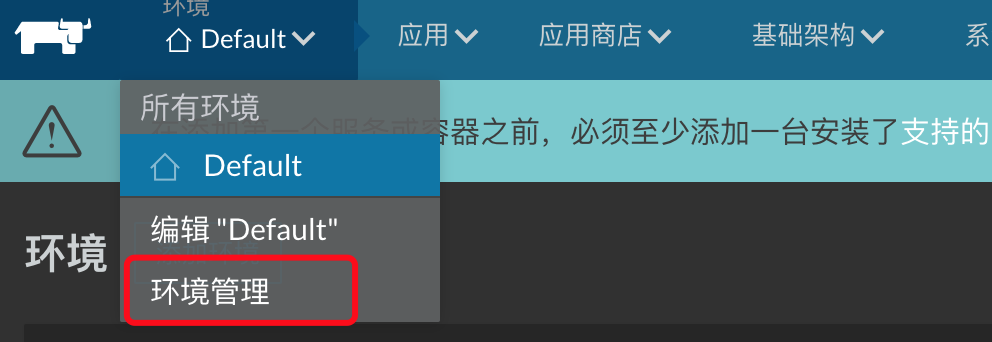
</p>

添加一个新的环境模板
<p align="center">
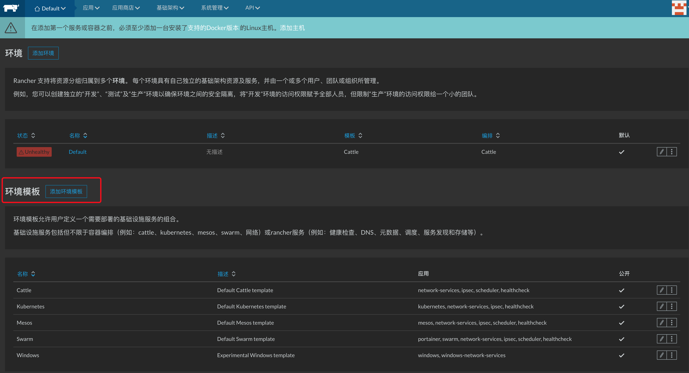
</p>

选择K8S,然后点击编辑环境
<p align="center">
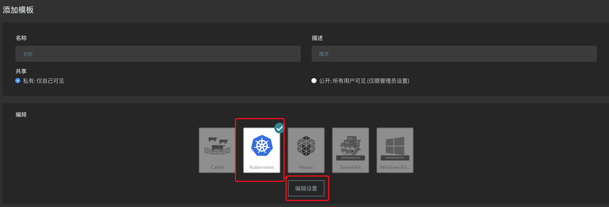
</p>

修改以下可配置项,更换K8S源

私有仓库地址：registry.cn-shenzhen.aliyuncs.com
<p align="center">
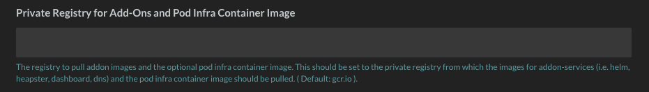
</p>

rancher_cn/pause-amd64:3.0

<p align="center">
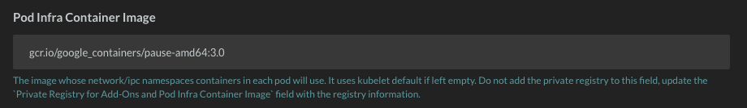
</p>

AAONS组件命名空间：rancher_cn
<p align="center">
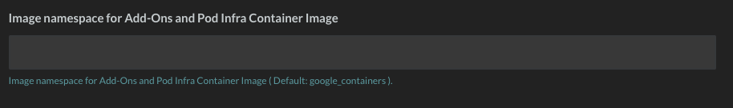
</p>

kubernetes-helm命名空间：rancher_cn

<p align="center">
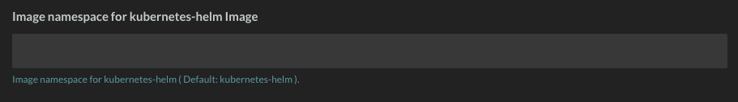
</p>


点击设置

<p align="center">
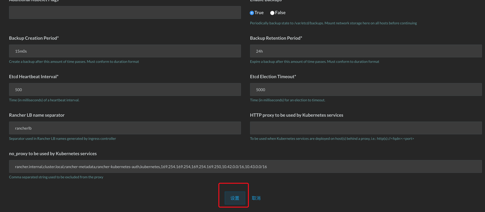
</p>

配置名称为K8S-CN

<p align="center">
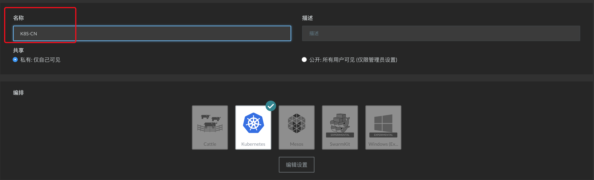
</p>


在页面最下面点击创建后就能看到有这样一个模板了
<p align="center">
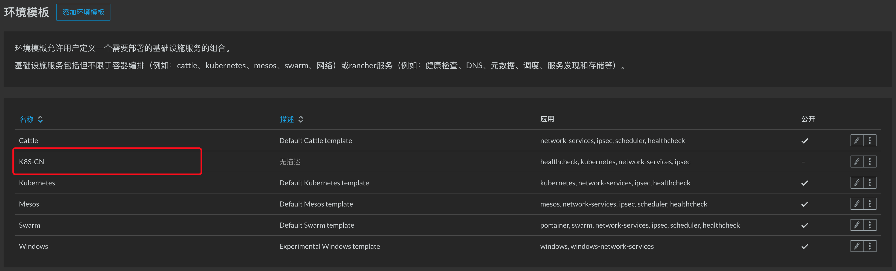
</p>


#### 2.创建一个K8S集群

这里统一使用的都是Centos7.4系统,Docker-17.03.02-ce版本

同样在环境配置中选择添加环境
<p align="center">
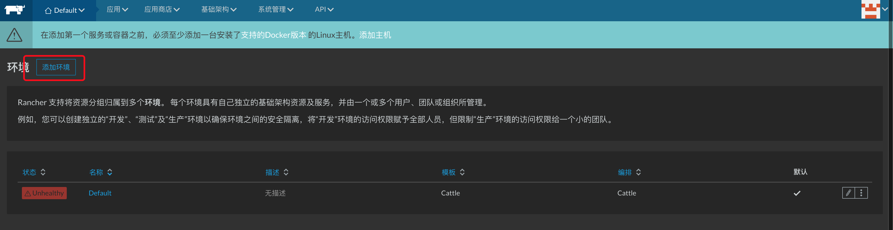
</p>

填写好名称K8S-DEMO选择我们之前创建好的国内K8S模板

<p align="center">
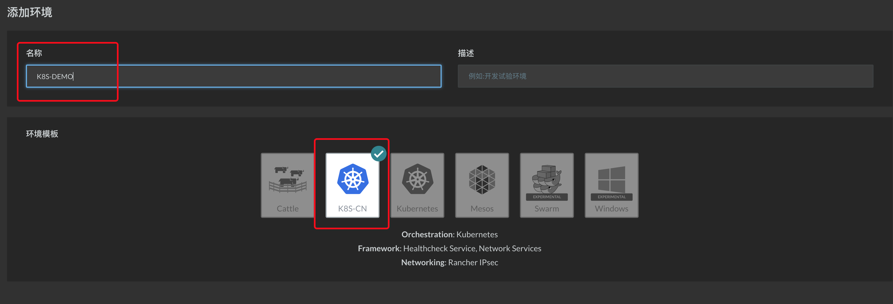
</p>

创建好之后在左上角选择我们创建的环境

<p align="center">
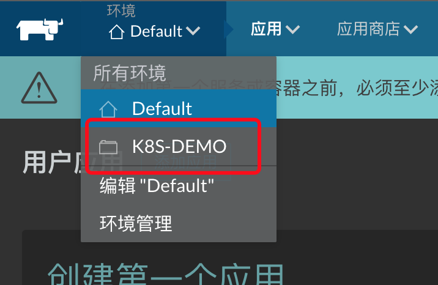
</p>


可以看到初始化进度,等待添加主机

<p align="center">
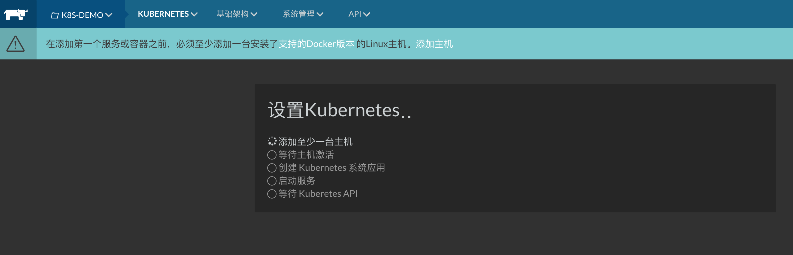
</p>


选择技术架构->主机

<p align="center">
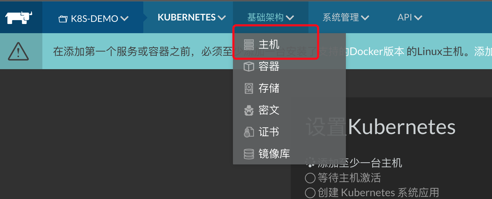
</p>


添加主机

<p align="center">
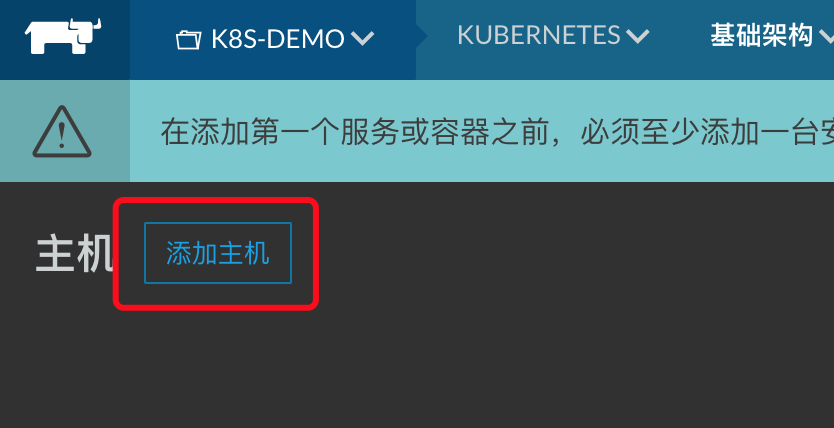
</p>

设置主机连接到Rancher的地址(在内网情况下使用内网IP)
<p align="center">
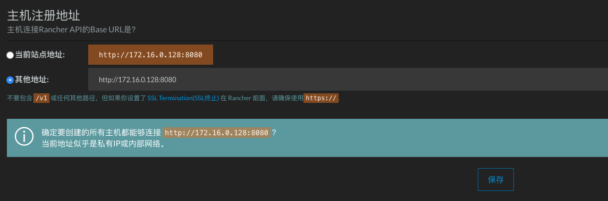
</p>

复制部署脚本(也可以直接接入云厂商服务)

<p align="center">
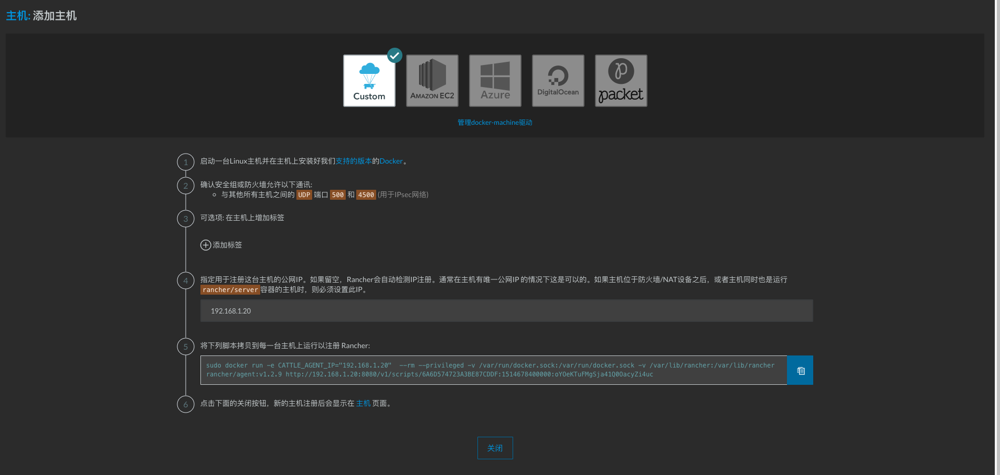
</p>

第四步<主机同时也是运行rancher/server容器的主机时，则必须设置此IP。> 我们在配置master是在rancher上配置的所以设置好主机的IP,推荐node节点也配置上对应的IP  
在服务器上运行脚本增加主机

<p align="center">
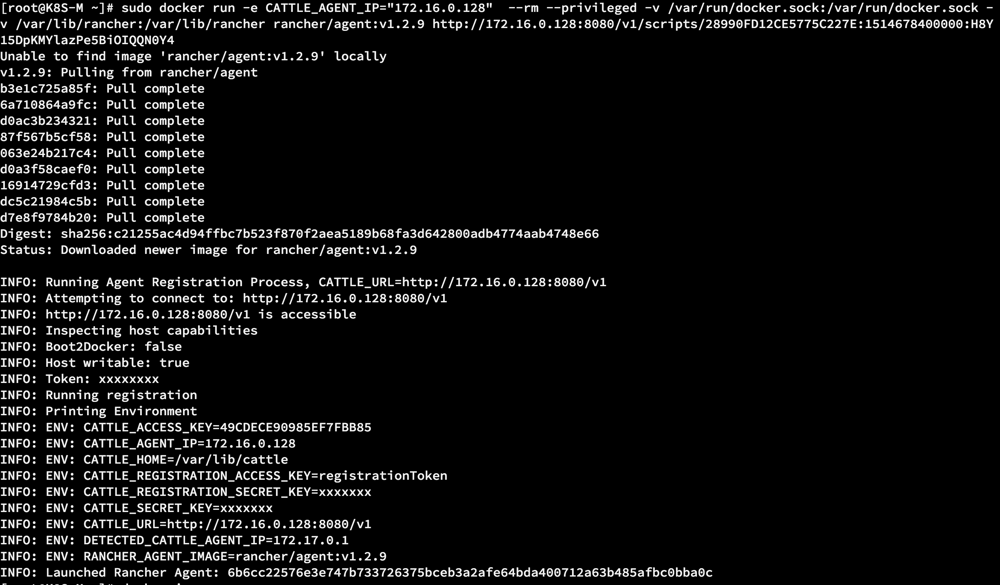
</p>

我们可以看到主机已经是活跃状态了,并且K8S相关组件都已经配置启动起来了

<p align="center">
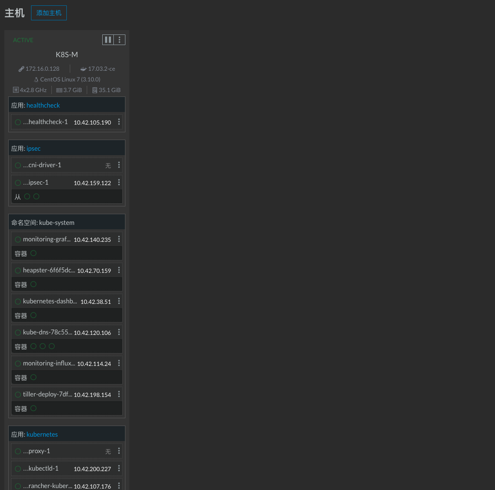
</p>

我们在接着加两台node节点

<p align="center">
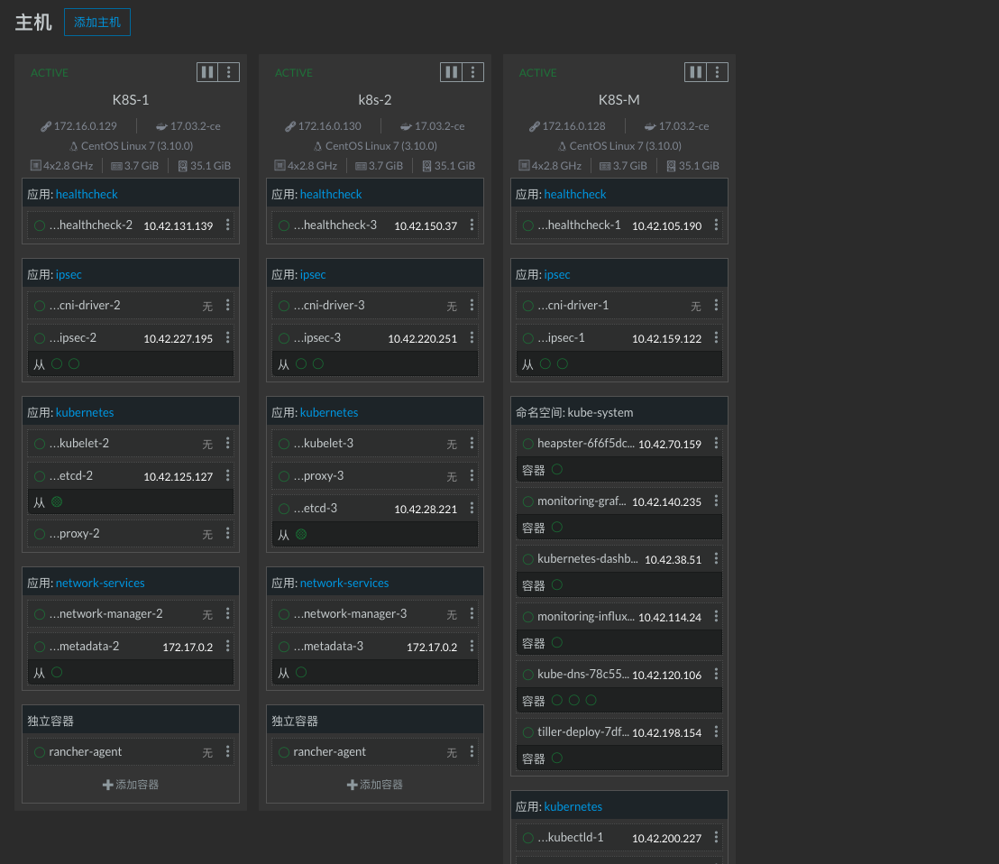
</p>

现在就有三台正常的主机了,通过上面菜单的KUBERNETES中的仪表盘可以进入到kubernetes-dashboard


#### 3. 尝试使用K8S

<p align="center">
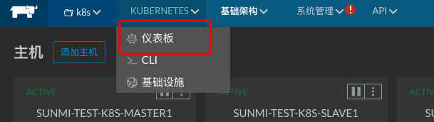
</p>

<p align="center">
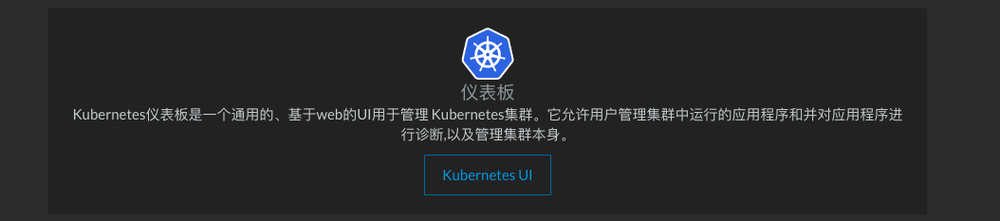
</p>

<p align="center">

</p>

选择cli可以使用在线ssh工具操作kubectl
<p align="center">
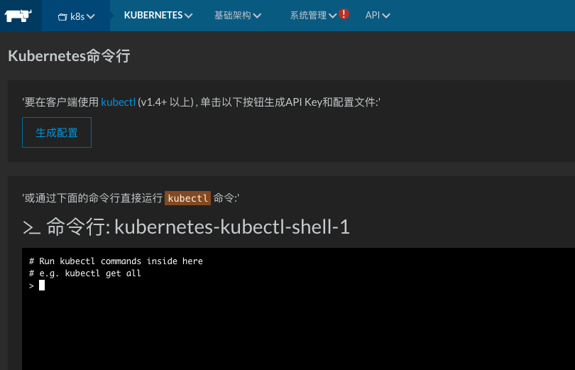
</p>

在K8S中运行一个nginx容器

```bash
> kubectl run kube-nginx --image=nginx:latest --port=80 --image-pull-policy=IfNotPresent
```

查看创建的pods查看容器对应的IP

```bash
> kubectl get pods -o wide
NAME                          READY     STATUS    RESTARTS   AGE       IP             NODE
kube-nginx-56495867b4-gvfrs   1/1       Running   0          58s       10.42.194.56   k8s-2
```

通过K8S分配的内部IP,就可以在web-shell中访问对应的nginx

```bash
> curl 10.42.194.56
<!DOCTYPE html>
<html>
<head>
<title>Welcome to nginx!</title>
```

如果不需要了可以使用以下命令进行删除

```bash
> kubectl delete deployment kube-nginx
deployment "kube-nginx" deleted
> kubectl get pods -o wide
No resources found.
```

