#### Kubernetes从入门到精通应用
<p align="center">
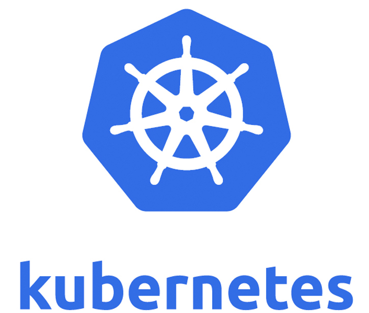
</p>

当今三大主流调度系统的比较与分析,为何选择kubernetes作为调度系统:

目前的容器编排调度工具中kubernetes是领导者，在我们深入学习和探讨kubernetes之前，我们比较下当今三大主流调度系统:Docker Swarm, Kuberentes和Messos的不同之处看看为何kubernetes可以成为当今容器编排调度工具的领导者。

* Docker Swarm

Docker Swarm是Docker公司的容器编排系统,使用的是标准Docker API，容器使用命令和docker命令是一套，简单方便。Docker Swarm基本架构是也是简单直接，每个主机运行一个Docker Swarm代理，一个主机运行一个Docker Swarm管理者，这个管理者负责指挥和调度这些主机上的容器，Docker Swarm以高可用性模式运行，Docker Swarm中的一个节点充当其他节点的管理器，包括调度程序和服务发现组件的容器。 Docker Swarm的优点和缺点都是使用标准的Docker接口，因为使用简单，容易集成到现有系统，所以在支持复杂的调度系统时候就会比较困难了，特别是在定制的接口中实现的调度。这也许就是成也在Docker，败也在Docker的原因所在。

* Kubernetes

Kubernetes作为一个容器集群管理系统，用于管理云平台中多个主机上的容器的应用，Kubernetes的目标是让部署容器化的应用简单并且高效（powerful）,Kubernetes提供了应用部署，规划，更新，维护的一整套完整的机制。 Kubernetes没有固定要求容器的格式，但是Kubernetes使用它自己的API和命令行接口（CLI）来进行容器编排。 除了Docker容器之外, Kubernetes还支持其他多种容器，如rkt——最初由CoreOS创建，现在是Cloud Native Computing Foundation(CNCF)基金会托管的项目。 Kubernetes 是自成体系的管理工具，可以实现容器调度，资源管理，服务发现，健康检查，自动伸缩，更新升级等，也可以在应用模版配置中指定副本数量，服务要求（IO优先，性能优先等），资源使用区间，标签（Labels等）来匹配特定要求达到预期状态等，这些特征便足以征服开发者，再加上Kubernetes有一个非常活跃的社区。它为用户提供了更多的选择以方便用户扩展编排容器来满足他们的需求。但是由于Kubernetes使用了自己的API，所以命令系统是另外一套系统，这也是kubernetes门槛比较高的原因所在。

* Apache Mesos

Apache Mesos是一个分布式系统内核的开源集群管理器，Mesos的出现早于Docker Swarm和Kubernetes。再加上Marathon，一个用于基于容器的应用程序的编排框架，它为Docker Swarm和Kubernetes提供了一个有效的替代方案。Mesos同时可以使用其他框架来同时支持容器化和非容器化的工作负载。

Apache Mesos能够在同样的集群机器上运行多种分布式系统类型，可以更加动态高效的共享资源。而且Messos也提供服务失败检查，服务发布，服务跟踪，服务监控，资源管理和资源共享。Messos可以扩展伸缩到数千个节点。 如果你拥有很多的服务器而且想构建一个大的集群的时候，Mesos就派上用场了。很多的现代化可扩展性的数据处理应用都可以在Mesos上运行，包括大数据框架Hadoop、Kafka、Spark。 但是大而全，往往就是对应的复杂和困难，这一点体现在Messos上是完全正确,与Docker和Docker Swarm 使用同一种API不同的，Mesos和Marathon都有自己的API，这使得它们比其他编排系统更加的复杂。 Apache Mesos是混合环境的完美编配工具，由于它包含容器和非容器的应用,虽然Messos很稳定，但是它的使用户快速学习应用变得更加困难，这也是在应用和部署场景下难于推广的原因之一。

大部分的应用程序我们在部署的时候都会适当的添加监控，对于运行载体容器则更应该如此。kubernetes提供了 liveness probes来检查我们的应用程序。它是由节点上的kubelet定期执行的。

大部分的应用程序我们在部署的时候都会适当的添加监控，对于运行载体容器则更应该如此。kubernetes提供了 liveness probes来检查我们的应用程序。它是由节点上的kubelet定期执行的。

#### Docker部署方案

首先安装docker环境，这个可以根据电脑系统的不同，选择不同的安装方式。

* [Mac安装](https://docs.docker.com/docker-for-mac/install/)
* [Ubantu安装](https://docs.docker.com/install/linux/docker-ce/ubuntu/)
* [Windows安装](https://docs.docker.com/docker-for-windows/install/)
* [centos安装](https://docs.docker.com/install/linux/docker-ce/centos/)

不过我这里是用脚本直接在centos上直接安装的:

```bash
yum install -y yum-utils device-mapper-persistent-data lvm2; #配置阿里云Docker Yum源

yum-config-manager --add-repo http://mirrors.aliyun.com/docker-ce/linux/centos/docker-ce.repo;#使用 Aliyun Docker

yum list docker-ce --showduplicates;#查看Docker版本

#安装较旧版本（比如Docker 17.03.2) 时需要指定完整的rpm包的包名，并且加上--setopt=obsoletes=0 参数：
yum install -y --setopt=obsoletes=0 \
   docker-ce-17.03.2.ce-1.el7.centos.x86_64 \
   docker-ce-selinux-17.03.2.ce-1.el7.centos.noarch;
  
#启动Docker服务
systemctl start docker.service;#重启dokcer
systemctl enable docker.service;#开机自动启动docker

```

#### 服务器配置
这里我用三台机器来搭建kubernetes集群,配置的服务器信息如下:

| 主机名      | IP            | 部署服务            | 数据盘挂载            |
| ---- | ------------------------------- |----------------- |----------------- |
|host1| 120.92.172.35|主机1|/data|
|host2| 120.92.169.191|主机2|/data|
|host3| 120.92.165.229 |主机3|/data|


Kubernetres虽然很好但是安装部署很复杂,为了业务的稳定和健壮性考虑,我们这里使用Rancher来搭建管理Kubernetes集群.

* Rancher官方地址: [https://www.cnrancher.com/](https://www.cnrancher.com/)  
* 本系列中使用 Kubernetes v1.8.10 RancherV1.6.14.
<p align="center">
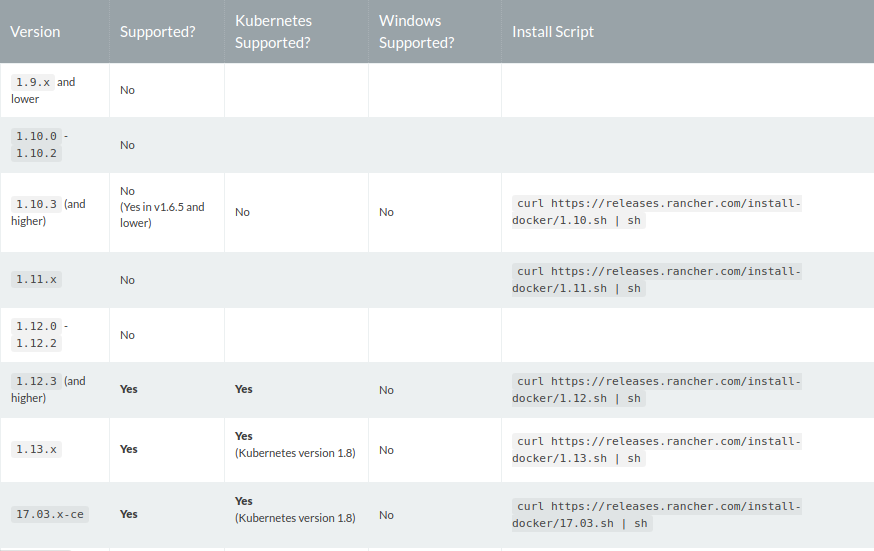
</p>


Rancher Server当前版本:
* rancher/server:latest 此标签是最新一次开发的构建版本。这些构建已经被CI框架自动验证测试。但这些release并不代表可以在生产环境部署。
* rancher/server:stable 此标签最新一个稳定的release构建。这个标签代表推荐在生产环境中使用的版本。

开始安装Rancher,这里使用Cenos7.4,并且安装好Docker-17.03.2-ce版本,在拉取稳定的Rancher-v1.6.14版本
```bash
> docker pull rancher/server:v1.6.14
```
启动一个单实例的Rancher:
```bash
> docker run -d --restart=unless-stopped -p 8080:8080 rancher/server:v1.6.14
```
这里需要关闭防火墙(主节点端口通讯需要关闭防火墙)):
```bash
> systemctl stop firewalld.service    # 关闭firewall
> systemctl disable firewalld.service # 禁止firewall开机启动
```
然后访问:http://120.92.172.35:8080 就可以看到:

<p align="center">
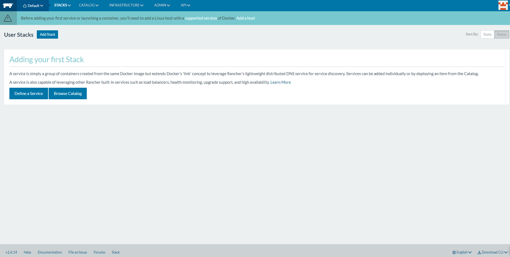
</p>

通过右下角可以编辑语言切换成简体中文:


<p align="center">
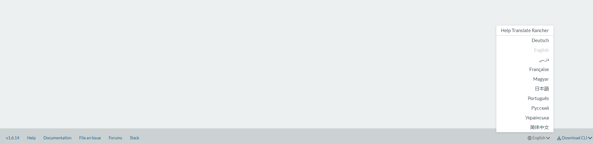
</p>


#### 权限设置
刚刚登录rancher的时候大家都可以看到没有任何的权限,但是一个系统我们肯定要设置权限的,而rancher也提供了这样的权限功能.在rancher访问控制中我们可以设置好权限控制,然后设置用户名和密码.

<p align="center">
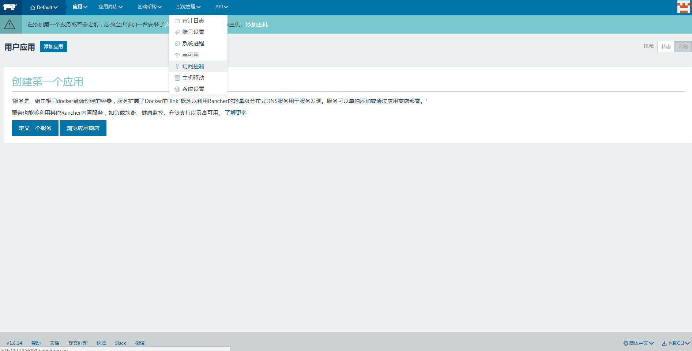
</p>


<p align="center">
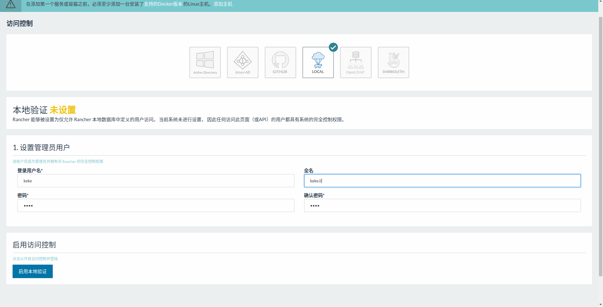
</p>


#### 配置kubernetes环境

如果我们直接创建一个kubernetes的环境会发现根本无法初始化,这里的原因是kubernetes的Docker包存放到gcr.io下面,https://cloud.google.com/container-registry , 在国内访问google是不能直接访问的,所以这里的第一件事情就要解决无法访问带来的痛苦,所以我们需要使用国内的K8S源.

这里先进入到环境管理:
<p align="center">
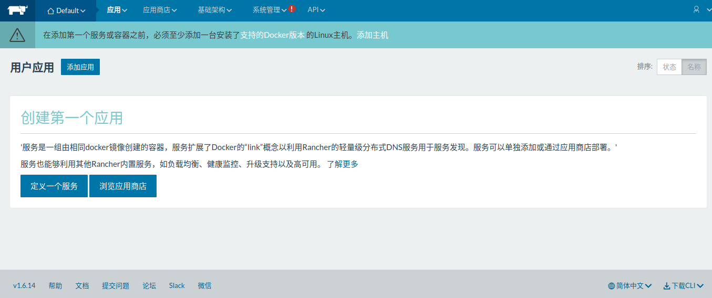
</p>
<p align="center">
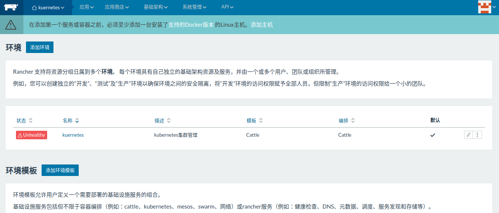
</p>

添加一个新的环境模板,点击编辑环境:
<p align="center">
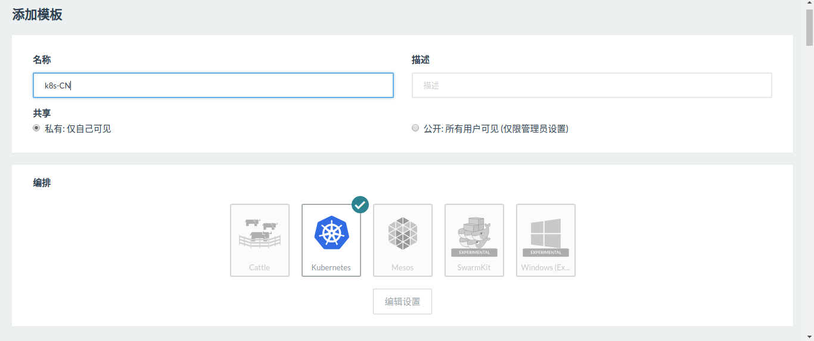
</p>

<p align="center">
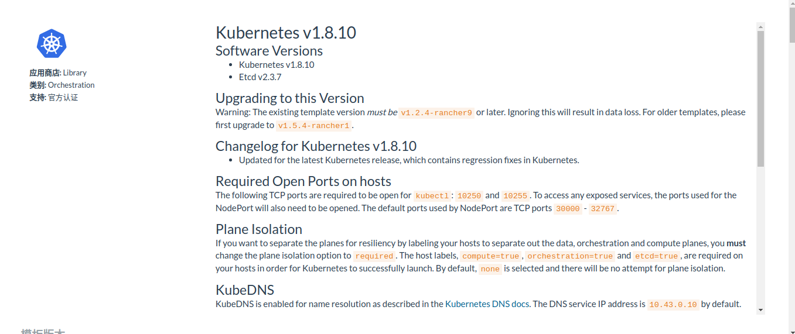
</p>

<p align="center">
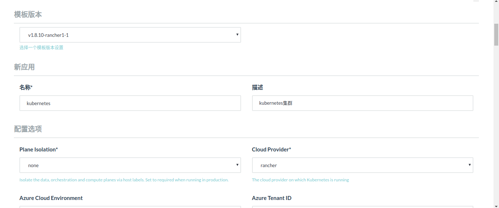
</p>

<p align="center">
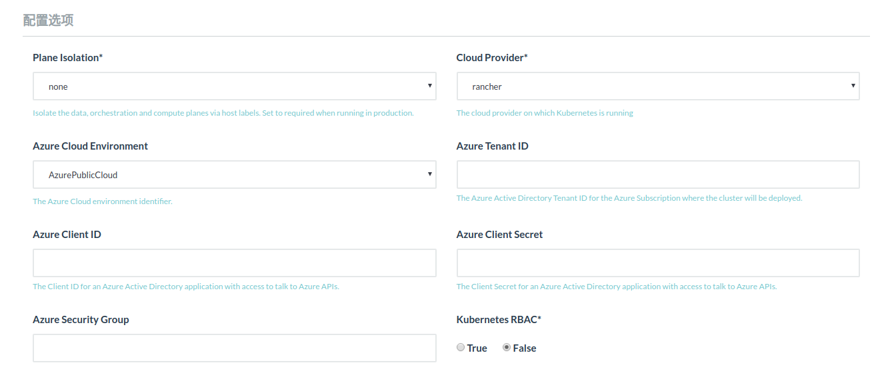
</p>

<p align="center">
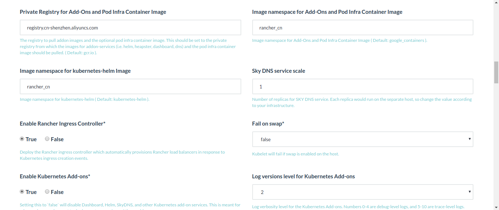
</p>

<p align="center">
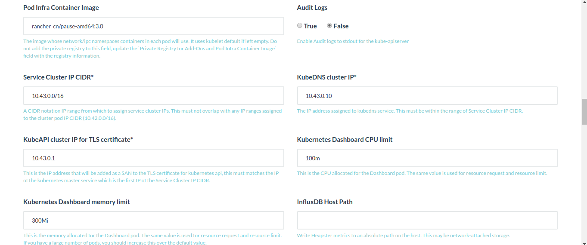
</p>

<p align="center">
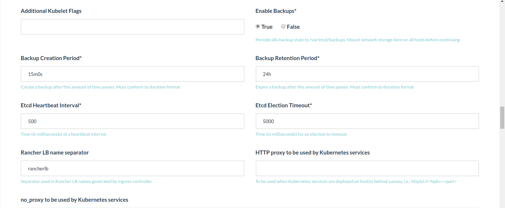
</p>

<p align="center">
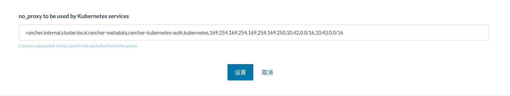
</p>
这里需要修改下配置项,更换K8S源,AAONS组件命名空间,kubernetes-helm命名空间,最后设置下!

点击编辑设置后，在弹出的页面中，更改如下几个参数：
* Private Registry for Add-Ons and Pod infra Container Images(修改私有仓库地址)：registry.cn-shenzhen.aliyuncs.com
* Image namespace for Add-ons and Pod infra Container Images(修改AAONS组件命名空间)：rancher_cn
* Image namespace for kubernetes-helm (修改kubernetes-helm命名空间)：rancher_cn
* Pod Infra Container Image (修改默认的pause镜像名):rancher_cn/pause-amd64:3.0

#### 添加主机
因为是第一次添加主机，系统会要求你确认节点注册地址，我们直接点击保存。

<p align="center">
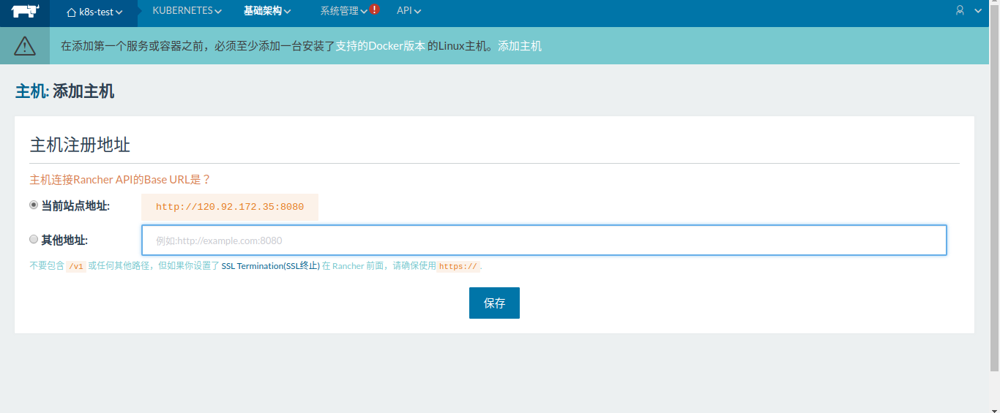
</p>

<p align="center">
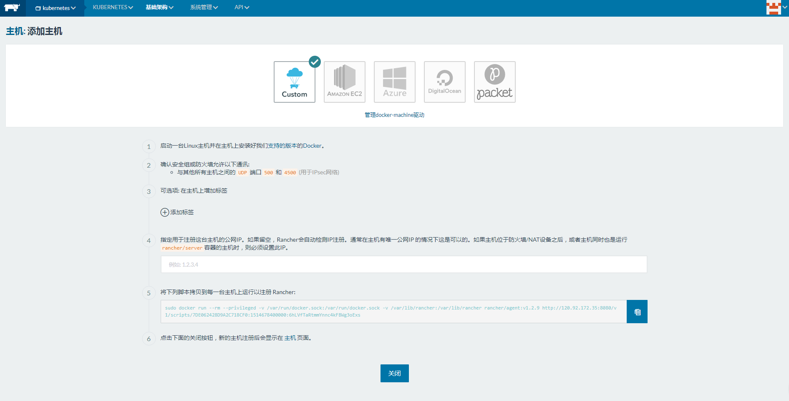
</p>

如果单台的kuberente这里就可以不用配置脚本,如果要配置多台服务器就需要依次把这里的脚本在每个服务上运行下.

然后进入kuebernetes仪表盘:

<p align="center">
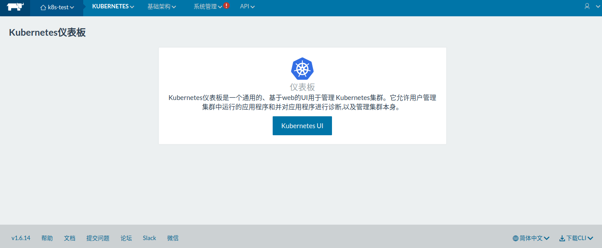
</p>

这就是kubernetes的 dashboard:
<p align="center">
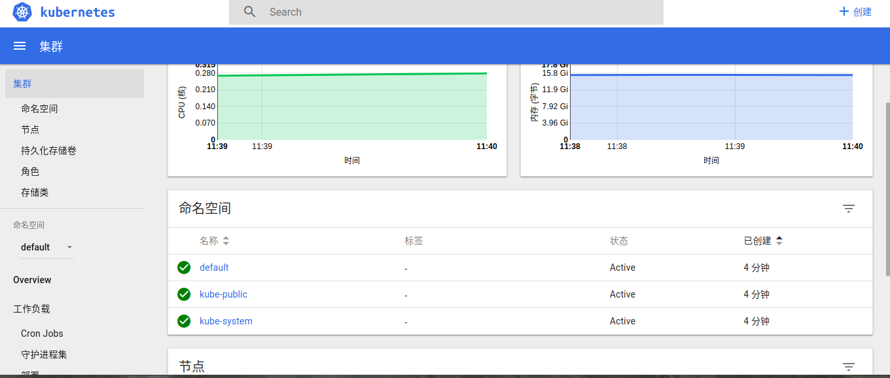
</p>


#### 核心组件解析

kubernetes的核心组件构成，它们之间协同工作从而完成整个集群的管理，分别为API Server、Controller Manager、Scheduler、Kubelet、Etcd。
一个简单的Pod工作流出发，涉及到架构中的组件并深入讲解其工作机制，这里解释下kubernetes中组件和资源对象的基本概念。
* Pod
kubernetes中运行应用最小单元，Pod封装了一个或多个应用程序的容器(比如nginx等),存储资源,唯一的网络IP以及管理容器的一些选项 Pod标示的是一个部署单元,可以理解为Kubernetes中的应用程序的单个实例,它可能由单个容器组成,也可能由少量紧密耦合并共享资源的容器组成。

* Replication Controller

Replication Controller是Kubernetes系统中的核心概念，用于管理Pod的生命周期。在Master内，Controller Manager进程通过RC的定义来完成Pod的创建、监控、启停等操作,负责维护集群的状态，比如故障检测、自动扩展、滚动更新等.

Kubernetes通过RC中定义的Label筛选出对应的Pod实例并实时监控其状态和数量，如果实例数量少于定义的副本数量，则会根据RC中定义的Pod模板来创建一个新的Pod，然后Scheduler将此Pod调度到合适的Node上启动运行，直到Pod实例数量达到预定目标。这个过程完全是自动化的。

* Service

Service服务为一组Pod提供单一稳定的名称和地址。他们作为基本负载均衡器而存在。是一系列Pod以及这些Pod的访问策略的抽象。访问Pod的代理抽象服务，主要用于集群内部的服务发现和负载均衡.

Service具有如下特征：
1. 拥有一个唯一指定的名字

2. 拥有一个虚拟IP和端口号

3. 能够提供某种远程服务能力

4. 被映射到提供这种服务能力的一组容器上

5. Service的服务进程目前都基于socket通信方式对外提供服务

Service的服务进程目前都基于socket通信方式对外提供服务，Kubernetes内置了透明的负载均衡以及故障恢复的机制。

* Deployment

Deployment集成了上线部署、滚动升级、创建副本、暂停上线任务，恢复上线任务，回滚到以前某一版本(成功/稳定)的Deployment等功能，在某种程度上，Deployment可以帮我们实现无人值守的上线，大大降低我们的上线过程的复杂沟通、操作风险。

Deployment的使用场景

1. 使用Deployment来启动（上线/部署）一个Pod或者ReplicaSet

2. 检查一个Deployment是否成功执行

3. 更新Deployment来重新创建相应的Pods

4. 如果目前的Deployment不稳定，那么回滚到一个早期的稳定的Deployment版本

* Label(标签)

Label(标签)是一组附加在对象上的键值对，主要解决Service与Pod之间的关联问题。

标签常用来从一组对象中选取符合条件的对象，这也是Kubernates中目前为止最重要的节点分组方法。标签的本质是附属在对象上的非系统属性类的元数据， 即它不是名字、Id以及对象的硬件属性，而是一些附加的键值对。

* Annotation(注解)

Annotation与Label类似，也使用key/value键值对的形式进行定义。Label具有严格的命名规则，它定义的是Kubernetes对象的元数据（Metadata），并且用于Label Selector。Annotation则是用户任意定义的”附加”信息，以便于外部工具进行查找。

* Scheduler

负责资源的调度，按照预定的调度策略将Pod调度到相应的机器上.

* Volume(容器共享存储卷)

Volume是Pod中能够被多个容器访问的共享目录。Kubernetes的Volume概念与Docker的Volume比较类似，但不完全相同。Kubernetes中的Volume与Pod生命周期相同，但与容器的生命周期不相关。当容器终止或者重启时，Volume中的数据也不会丢失。另外，Kubernetes支持多种类型的Volume，并且一个Pod可以同时使用任意多个Volume。

* Persistent Volume(持久卷)

Persistent Volume(PV)是集群之中的一块网络存储。跟Node一样，也是集群的资源。PV跟Volume (卷)类似，不过会有独立于Pod的生命周期。

* Kubelet

负责维护容器的生命周期，同时也负责Volume（CVI）和网络（CNI）的管理.

* kube-proxy

负责为Service提供cluster内部的服务发现和负载均衡.

* Etcd

分布式键值对（k,v）存储服务，存储了个集群的状态信息.

#### Pod的整个生命阶段：

* Pending
表示集群系统正在创建Pod，但是Pod中的container还没有全部被创建，这其中也包含集群为container创建网络，或者下载镜像的时间；

* Running
表示pod已经运行在一个节点商量，并且所有的container都已经被创建。但是并不代表所有的container都运行，它仅仅代表至少有一个container是处于运行的状态或者进程出于启动中或者重启中；

* Succeeded
所有Pod中的container都已经终止成功，并且没有处于重启的container；

#### Failed

所有的Pod中的container都已经终止了，但是至少还有一个container没有被正常的终止(其终止时的退出码不为0)

* 对于liveness 

probes的结果也有几个固定的可选项值：

```
Success：表示通过检测

Failure：表示没有通过检测

Unknown：表示检测没有正常进行
```
#### 部署应用nginx
编写一个nginx的yaml,然后部署到kubernetes上:
```yaml
apiVersion: extensions/v1beta1                  # K8S对应的API版本
kind: Deployment                                # 对应的类型
metadata:
  name: nginx-deployment
  labels:
    name: nginx-deployment
spec:
  replicas: 2                                   # 镜像副本数量
  template:
    metadata:
      labels:                                   # 容器的标签 可和service关联
        app: nginx
    spec:
      containers:
        - name: nginx                          # 容器名和镜像
          image: nginx
          imagePullPolicy: Always

```
然后查看kuberentes的dashboard:
<p align="center">
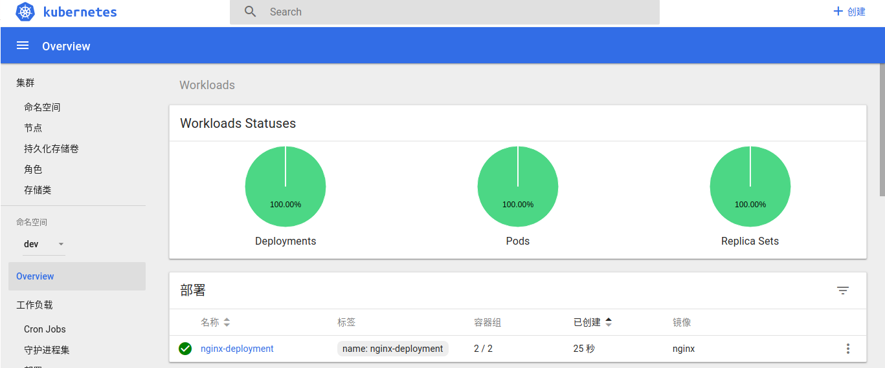
</p>


#### 集群搭建

* [本节kubernetes集群搭建讲述视频](https://www.youtube.com/watch?v=DJgYlmGCmDA)
