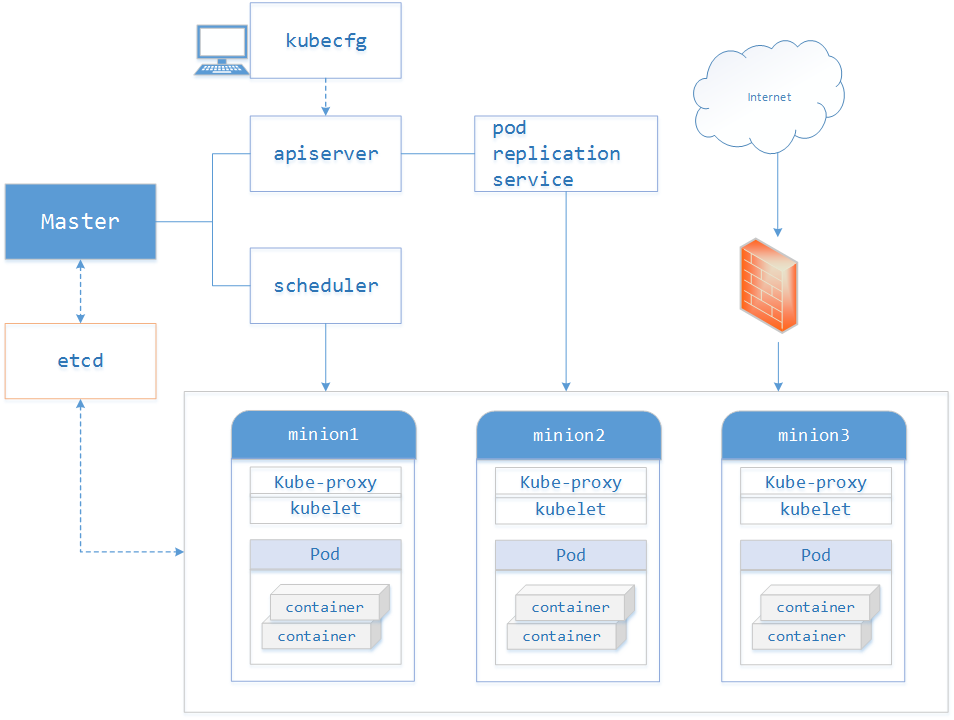
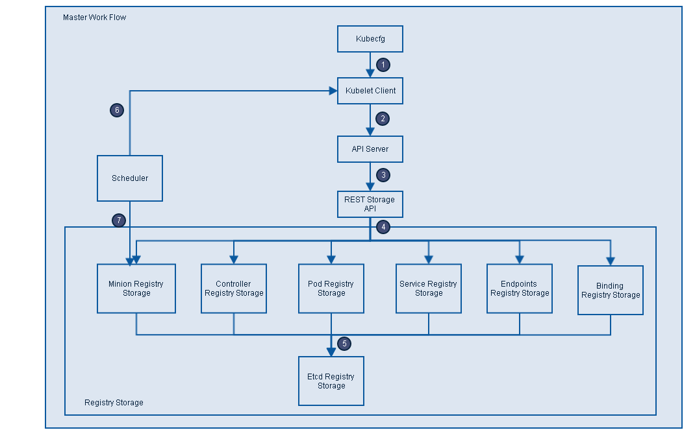
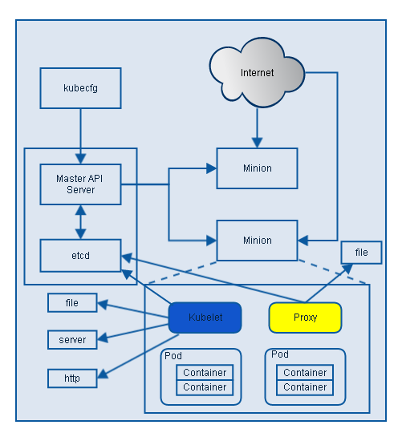

# kubernetes pods arrange

在Kubernetes中，能够被创建、调度和管理的最小部署单元是Pod，而非单个容器。

K8s有很多技术概念，同时对应很多API对象，最重要的也是最基础的是微服务Pod。Pod是在K8s集群中运行部署应用或服务的最小单元，它是可以支持多容器的。Pod的设计理念是支持多个容器在一个Pod中共享网络地址和文件系统，可以通过进程间通信和文件共享这种简单高效的方式组合完成服务。Pod对多容器的支持是K8s最基础的设计理念。比如你运行一个操作系统发行版的软件仓库，一个Nginx容器用来发布软件，另一个容器专门用来从源仓库做同步，这两个容器的镜像不太可能是一个团队开发的，但是他们一块儿工作才能提供一个微服务；这种情况下，不同的团队各自开发构建自己的容器镜像，在部署的时候组合成一个微服务对外提供服务。

Pod是K8s集群中所有业务类型的基础，可以看作运行在K8s集群中的小机器人，不同类型的业务就需要不同类型的小机器人去执行。目前K8s中的业务主要可以分为长期伺服型（long-running）、批处理型（batch）、节点后台支撑型（node-daemon）和有状态应用型（stateful application）；分别对应的小机器人控制器为`Deployment`、`Job`、`DaemonSet`和`StatefulSet`.

#### Kubernetes各组件介绍

* Pods

在Kubernetes系统中，调度的最小颗粒不是单纯的容器，而是抽象成一个Pod，Pod是一个可以被创建、销毁、调度、管理的最小的部署单元。把相关的一个或多个容器（Container）构成一个Pod，通常Pod里的容器运行相同的应用。

Pod包含的容器运行在同一个Minion(Host)上，看作一个统一管理单元，共享相同的`volumes`和`network namespace/IP`和Port空间。

* Services

Services也是Kubernetes的基本操作单元，是真实应用服务的抽象，每一个服务后面都有很多对应的容器来支持，通过Proxy的port和服务selector决定服务请求传递给后端提供服务的容器，对外表现为一个单一访问地址，外部不需要了解后端如何运行，这给扩展或维护后端带来很大的好处。

* Replication Controller

Replication Controller，理解成更复杂形式的pods，它确保任何时候Kubernetes集群中有指定数量的pod副本(replicas)在运行，如果少于指定数量的pod副本(replicas)，Replication Controller会启动新的Container，反之会杀死多余的以保证数量不变。`Replication Controller`使用预先定义的pod模板创建pods，一旦创建成功，pod 模板和创建的pods没有任何关联，可以修改 pod 模板而不会对已创建pods有任何影响，也可以直接更新通过`Replication Controller`创建的pods。对于利用 pod 模板创建的pods，`Replication Controller`根据 `label selector` 来关联，通过修改pods的label可以删除对应的pods。

Replication Controller主要有如下用法：

1. Rescheduling

Replication Controller会确保Kubernetes集群中指定的pod副本(replicas)在运行， 即使在节点出错时。

2. Scaling

通过修改Replication Controller的副本(replicas)数量来水平扩展或者缩小运行的pods。

3. Rolling updates

Replication Controller的设计原则使得可以一个一个地替换pods来滚动更新（rolling updates）服务。

4. Multiple release tracks
如果需要在系统中运行multiple release的服务，Replication Controller使用labels来区分multiple release tracks

* Labels

service和replicationController只是建立在pod之上的抽象，最终是要作用于pod的,但是它们如何跟pod联系起来呢？

这就引入了label的概念：label其实很好理解，就是为pod加上可用于搜索或关联的一组`key/value`标签，而service和replicationController正是通过label来与pod关联的。
为了将访问Service的请求转发给后端提供服务的多个容器，正是通过标识容器的labels来选择正确的容器；Replication Controller也使用labels来管理通过 pod 模板创建的一组容器，这样Replication Controller可以更加容易，方便地管理多个容器。

如下图所示，有三个pod都有label为"app=backend"，创建service和`replicationController`时可以指定同样的label:"app=backend"，再通过label selector机制，就将它们与这三个pod关联起来了。

例如，当有其他frontend pod访问该service时，自动会转发到其中的一个backend pod。

#### Kubenetes整体框架

Kubenetes整体框架如下图，主要包括kubecfg、Master API Server、Kubelet、Minion(Host)以及Proxy。

1. Master

Master定义了Kubernetes 集群Master API Server的主要声明，包括`Pod Registry`、`Controller Registry`、`Service Registry`、`Endpoint Registry`、`Minion Registry`、`Binding Registry`、`RESTStorage`以及`Client`, 是client(Kubecfg)调用Kubernetes API，管理Kubernetes主要构件Pods、Services、Minions、容器的入口。

Master由API Server、Scheduler以及Registry等组成。从下图可知Master的工作流主要分以下步骤：

* Kubecfg将特定的请求，比如创建Pod，发送给Kubernetes Client。
* Kubernetes Client将请求发送给API server。
* API Server根据请求的类型，比如创建Pod时storage类型是pods，然后依此选择何种REST Storage API对请求作出处理。
* REST Storage API对的请求作相应的处理。
* 将处理的结果存入高可用键值存储系统Etcd中。
* 在API Server响应Kubecfg的请求后，Scheduler会根据Kubernetes Client获取集群中运行Pod及Minion信息。
* 依据从Kubernetes Client获取的信息，Scheduler将未分发的Pod分发到可用的Minion节点上。

Master的主要构件的详细介绍。

* Minion Registry

Minion Registry负责跟踪Kubernetes 集群中有多少Minion(Host)。Kubernetes封装Minion Registry成实现Kubernetes API Server的RESTful API接口REST，通过这些API，我们可以对Minion Registry做Create、Get、List、Delete操作，由于Minon只能被创建或删除，所以不支持Update操作，并把Minion的相关配置信息存储到etcd。除此之外，Scheduler算法根据Minion的资源容量来确定是否将新建Pod分发到该Minion节点。

* Pod Registry

Pod Registry负责跟踪Kubernetes集群中有多少Pod在运行，以及这些Pod跟Minion是如何的映射关系。将Pod Registry和Cloud Provider信息及其他相关信息封装成实现Kubernetes API Server的RESTful API接口REST。通过这些API，我们可以对Pod进行Create、Get、List、Update、Delete操作，并将Pod的信息存储到etcd中，而且可以通过Watch接口监视Pod的变化情况，比如一个Pod被新建、删除或者更新。

* Service Registry

Service Registry负责跟踪Kubernetes集群中运行的所有服务。根据提供的Cloud Provider及Minion Registry信息把Service Registry封装成实现Kubernetes API Server需要的RESTful API接口REST。利用这些接口，我们可以对Service进行Create、Get、List、Update、Delete操作，以及监视Service变化情况的watch操作，并把Service信息存储到etcd。

* Controller Registry

Controller Registry负责跟踪Kubernetes集群中所有的Replication Controller，Replication Controller维护着指定数量的pod 副本(replicas)拷贝，如果其中的一个容器死掉，Replication Controller会自动启动一个新的容器，如果死掉的容器恢复，其会杀死多出的容器以保证指定的拷贝不变。通过封装Controller Registry为实现Kubernetes API Server的RESTful API接口REST， 利用这些接口，我们可以对Replication Controller进行Create、Get、List、Update、Delete操作，以及监视Replication Controller变化情况的watch操作，并把Replication Controller信息存储到etcd。

* Endpoints Registry

Endpoints Registry负责收集Service的endpoint，比如Name："mysql"，Endpoints: ["10.10.1.1:1909"，"10.10.2.2:8834"]，同Pod Registry，Controller Registry也实现了Kubernetes API Server的RESTful API接口，可以做Create、Get、List、Update、Delete以及watch操作。

* Binding Registry

Binding包括一个需要绑定Pod的ID和Pod被绑定的Host，Scheduler写Binding Registry后，需绑定的Pod被绑定到一个host。Binding Registry也实现了Kubernetes API Server的RESTful API接口，但Binding Registry是一个write-only对象，所有只有Create操作可以使用， 否则会引起错误。

* Scheduler

Scheduler收集和分析当前Kubernetes集群中所有Minion节点的资源(内存、CPU)负载情况，然后依此分发新建的Pod到Kubernetes集群中可用的节点。由于一旦Minion节点的资源被分配给Pod，那这些资源就不能再分配给其他Pod， 除非这些Pod被删除或者退出， 因此，Kubernetes需要分析集群中所有Minion的资源使用情况，保证分发的工作负载不会超出当前该Minion节点的可用的资源范围。具体来说，Scheduler做以下工作：

1. 实时监测Kubernetes集群中未分发的Pod。
2. 实时监测Kubernetes集群中所有运行的Pod，Scheduler需要根据这些Pod的资源状况安全地将未分发的Pod分发到指定的Minion节点上。
3. Scheduler也监测Minion节点信息，由于会频繁查找Minion节点，Scheduler会缓存一份最新的信息在本地。
4. Scheduler在分发Pod到指定的Minion节点后，会把Pod相关的信息Binding写回API Server。

#### kubelet

Kubelet是Kubernetes集群中每个Minion和Master API Server的连接点，Kubelet运行在每个Minion上，是Master API Server和Minion之间的桥梁，接收Master API Server分配给它的commands和work，与持久性键值存储etcd、file、server和http进行交互，读取配置信息。Kubelet的主要工作是管理Pod和容器的生命周期，其包括Docker Client、Root Directory、Pod Workers、Etcd Client、Cadvisor Client以及Health Checker组件，具体工作如下：

1. 通过Worker给Pod异步运行特定的Action
2. 设置容器的环境变量
3. 给容器绑定Volume
4. 给容器绑定Port
5. 根据指定的Pod运行一个单一容器
6. kill杀死容器
7. 给指定的Pod创建network 容器
8. 删除Pod的所有容器
9. 同步Pod的状态
10. 从cAdvisor获取container info、 pod info、 root info、 machine info
11. 检测Pod的容器健康状态信息
12. 在容器中运行命令。

* API Server资源操作入口

API Server 提供了资源对象的唯一操作入口，其它所有组件都必须通过它提供的 API 来操作资源数据。只有 API Server 会与存储通信，其它模块都必须通过 API Server 访问集群状态。

API Server 作为 Kubernetes 系统的入口，封装了核心对象的增删改查操作。API Server 以 RESTFul 接口方式提供给外部客户和内部组件调用，API Server 再对相关的资源数据（全量查询 + 变化监听）进行操作，以达到实时完成相关的业务功能。

以 API Server 为 Kubernetes 入口的设计主要有以下好处：

1. 保证了集群状态访问的安全。
2. API Server 隔离了集群状态访问和后端存储实现，这样 API Server 状态访问的方式不会因为后端存储技术 Etcd 的改变而改变，让后端存储方式选择更加灵活，方便了整个架构的扩展。

* Controller Manager内部管理控制中心

Controller Manager 用于实现 Kubernetes 集群故障检测和恢复的自动化工作。Controller Manager 主要负责执行以下各种控制器：

1. Replication Controller

Replication Controller 的作用主要是定期关联 Replication Controller (RC) 和 Pod，以保证集群中一个 RC (一种资源对象) 所关联的 Pod 副本数始终保持为与预设值一致。

2. Node Controller

Kubelet 在启动时会通过 API Server 注册自身的节点信息，并定时向 API Server 汇报状态信息。API Server 在接收到信息后将信息更新到 Etcd 中。
Node Controller 通过 API Server 实时获取 Node 的相关信息，实现管理和监控集群中的各个 Node 节点的相关控制功能。

3. ResourceQuota Controller

资源配额管理控制器用于确保指定的资源对象在任何时候都不会超量占用系统上物理资源。

4. Namespace Controller

用户通过 API Server 可以创建新的 Namespace 并保存在 Etcd 中，Namespace Controller 定时通过 API Server 读取这些 Namespace 信息来操作 Namespace。

比如：Namespace 被 API 标记为优雅删除，则将该 Namespace 状态设置为 Terminating 并保存到 Etcd 中。同时 Namespace Controller 删除该 Namespace 下的 ServiceAccount、RC、Pod 等资源对象。

5. Service Account Controller

Service Account Controller (服务账号控制器)，主要在命名空间内管理 ServiceAccount，以保证名为 default 的 ServiceAccount 在每个命名空间中存在。

6. Token Controller

Token Controller（令牌控制器）作为 Controller Manager 的一部分，主要用作：监听 serviceAccount 的创建和删除动作以及监听 secret 的添加、删除动作。

7. Service Controller

Service Controller 是属于 Kubernetes 集群与外部平台之间的一个接口控制器，Service Controller 主要用作监听 Service 的变化。

比如：创建的是一个 LoadBalancer 类型的 Service，Service Controller 则要确保外部的云平台上对该 Service 对应的 LoadBalancer 实例被创建、删除以及相应的路由转发表被更新。

8. Endpoint Controller

Endpoints 表示了一个 Service 对应的所有 Pod 副本的访问地址，而 Endpoints Controller 是负责生成和维护所有 Endpoints 对象的控制器。

Endpoint Controller 负责监听 Service 和对应的 Pod 副本的变化。定期关联 Service 和 Pod (关联信息由 Endpoint 对象维护)，以保证 Service 到 Pod 的映射总是最新的。

* Scheduler集群分发调度器

1. Scheduler 主要用于收集和分析当前 Kubernetes 集群中所有 Minion / Node 节点的资源 (包括内存、CPU 等) 负载情况，然后依据资源占用情况分发新建的 Pod 到 Kubernetes 集群中可用的节点。
2. Scheduler 会实时监测 Kubernetes 集群中未分发和已分发的所有运行的 Pod。
3. Scheduler 会实时监测 Minion / Node 节点信息，由于会频繁查找 Minion/Node 节点，Scheduler 同时会缓存一份最新的信息在本地。
4. Scheduler 在分发 Pod 到指定的 Minion / Node 节点后，会把 Pod 相关的信息 Binding 写回 API Server，以方便其它组件使用。

* Kubelet节点上的Node

1. 负责 Node 节点上 Pod 的创建、修改、监控、删除等全生命周期的管理。
2. 定时上报本地 Node 的状态信息给 API Server。
3. Kubelet 是 Master API Server 和 Minion / Node 之间的桥梁，接收 Master API Server 分配给它的 Commands 和 Work。
4. Kubelet 通过 Kube ApiServer 间接与 Etcd 集群交互来读取集群配置信息。
5. Kubelet 在 Node 上做的主要工作具体如下：
(1). 设置容器的环境变量、给容器绑定 Volume、给容器绑定 Port、根据指定的 Pod 运行一个单一容器、给指定的 Pod 创建 Network 容器。
(2). 同步 Pod 的状态，从 cAdvisor 获取 Container Info、 Pod Info、 Root Info、 Machine info。
(3). 在容器中运行命令、杀死容器、删除 Pod 的所有容器。

在k8s集群中，如果想避免同一个Node节点上调度两个不同的服务，可以通过节点选择器和节点亲和性两种方式。

1. nodeSelector 是节点选择约束的最简单推荐形式。你可以将 nodeSelector 字段添加到 Pod 的规约中设置你希望目标节点所具有的节点标签。 Kubernetes 只会将 Pod 调度到拥有你所指定的每个标签的节点上。
2. 节点亲和性
节点亲和性概念上类似于 nodeSelector， 它使你可以根据节点上的标签来约束 Pod 可以调度到哪些节点上。 节点亲和性有两种：
requiredDuringSchedulingIgnoredDuringExecution： 调度器只有在规则被满足的时候才能执行调度。此功能类似于 nodeSelector， 但其语法表达能力更强。
preferredDuringSchedulingIgnoredDuringExecution： 调度器会尝试寻找满足对应规则的节点。如果找不到匹配的节点，调度器仍然会调度该 Pod。

#### Proxy

Proxy是为了解决外部网络能够访问跨机器集群中容器提供的应用服务而设计的，运行在每个Minion或者Node上。

Proxy提供TCP/UDP sockets的proxy，每创建一种Service，Proxy主要从etcd获取Services和Endpoints的配置信息（也可以从file获取），然后根据配置信息在Minion或者Node上启动一个Proxy的进程并监听相应的服务端口，当外部请求发生时，Proxy会根据Load Balancer将请求分发到后端正确的容器处理。

所以Proxy不但解决了同一主宿机相同服务端口冲突的问题，还提供了Service转发服务端口对外提供服务的能力，Proxy后端使用了随机、轮询负载均衡算法。

#### Kubectl

Kubectl 是 Kubernetes 的 客户端的工具。 通过 Kubectl 命令对 API Server 进行操作，API Server 响应并返回对应的命令结果，从而达到对 Kubernetes 集群的管理。

License
This is free software distributed under the terms of the MIT license
