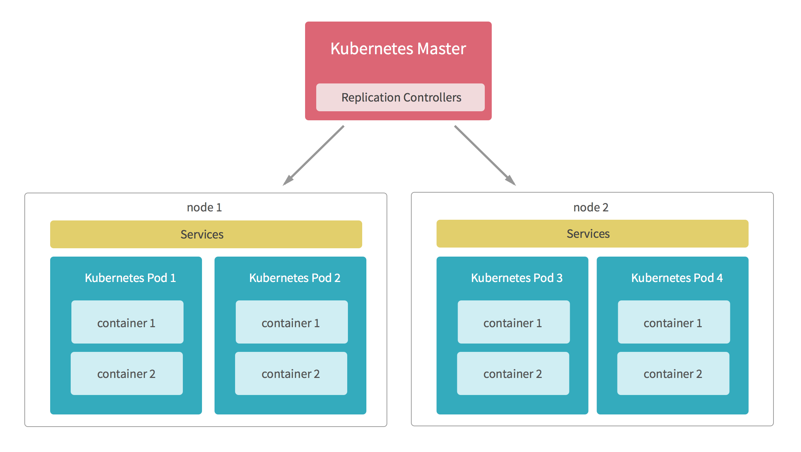

## kubernetes pods

在Kubernetes中，能够被创建、调度和管理的最小部署单元是Pod，而非单个容器。

K8s有很多技术概念，同时对应很多API对象，最重要的也是最基础的是微服务Pod。Pod是在K8s集群中运行部署应用或服务的最小单元，它是可以支持多容器的。Pod的设计理念是支持多个容器在一个Pod中共享网络地址和文件系统，可以通过进程间通信和文件共享这种简单高效的方式组合完成服务。Pod对多容器的支持是K8s最基础的设计理念。比如你运行一个操作系统发行版的软件仓库，一个Nginx容器用来发布软件，另一个容器专门用来从源仓库做同步，这两个容器的镜像不太可能是一个团队开发的，但是他们一块儿工作才能提供一个微服务；这种情况下，不同的团队各自开发构建自己的容器镜像，在部署的时候组合成一个微服务对外提供服务。

Pod是K8s集群中所有业务类型的基础，可以看作运行在K8s集群中的小机器人，不同类型的业务就需要不同类型的小机器人去执行。目前K8s中的业务主要可以分为长期伺服型（long-running）、批处理型（batch）、节点后台支撑型（node-daemon）和有状态应用型（stateful application）；分别对应的小机器人控制器为Deployment、Job、DaemonSet和StatefulSet;

<p align="center">

</p>

Pod里的容器是共享网络和存储的。

Pods包含多个容器，是连接在一起的容器组合并共享文件卷。它们是最小的部署单元，由 Kubernetes 统一创建、调度、管理。Pods是可以直接创建的，但推荐的做法是使用 Replication Controller，即使是创建一个 Pod。

一个Pod可以被一个容器化的环境看做是应用层的逻辑宿主机(Logical Host)，通常一个Node中可以运行几百个Pod，每个Pod中有多个容器应用，同一个Pod中的多个容器应用通常是紧密耦合的(相当于多个业务容器组成的一个逻辑虚拟机)。

一个Pod中的多个容器应用通常是紧耦合的。Pod在Node上被创建、启动或者销毁。

每个Pod中有一个特殊的Pause容器，其他的成为业务容器，这些业务容器共享Pause容器的网络栈以及Volume挂载卷，因而他们之间的通信及数据交互更为高效。

同一个pod中的业务容器共享如下资源：

* PID命名空间(不同应用程序可以看到其他应用程序的PID)
* 网络命名空间(pod中多个容器可以访问同一个IP和端口范围)
* IPC命名空间(能够使用SystemV IPC或者POSIX消息队列进行通信)
* UTS命名空间(共享同一个主机名)
* Volumes(访问定义在pod级别的存储卷)

Pod可以单独创建。由于Pods没有可控的生命周期，如果他们进程死掉了，他们将不会重新创建。出于这个原因，建议您使用复制控制器。

#### Pods定义详解

一个Pods中的yaml详解：

```bash
kind: Deployment  #指定创建资源的角色/类型
apiVersion: extensions/v1beta1 #指定api版本，此值必须在kubectl apiversion中
metadata:   #资源的元数据/属性
  name: mean #资源的名字，在同一个namespace中必须唯一
  namespace: default
  generation: 1 # 用于标识当前对象目标状态的代别；
  annotations:  #自定义注解列表
    deployment.kubernetes.io/revision: '1'  #自定义注解名字
spec:   #specification of the resource content 指定该资源的内容
  replicas: 1 #副本数量* etcd保存了整个集群的状态;
  apiserver提供了资源操作的唯一入口，并提供认证、授权、访问控制、API注册和发现等机制；
  controller manager负责维护集群的状态，比如故障检测、自动扩展、滚动更新等；
  scheduler负责资源的调度，按照预定的调度策略将Pod调度到相应的机器上；
  kubelet负责维持容器的生命周期，同时也负责Volume（CVI）和网络（CNI）的管理；
  Container runtime负责镜像管理以及Pod和容器的真正运行（CRI）；
  kube-proxy负责为Service提供cluster内部的服务发现和负载均衡；
  kube-dns负责为整个集群提供DNS服务;
  Ingress Controller为服务提供外网入口;
  Heapster提供资源监控;
  Dashboard提供GUI;
  Federation提供跨可用区的集群;
  Fluentd-elasticsearch提供集群日志采集、存储与查询  
  selector:
    matchLabels:
      app: mean
  template:  #这里Pod的定义
    metadata:
      name: mean
      creationTimestamp: #当前对象创建的日期时间时间戳；
      labels:
        app: mean
    spec:
      containers:
      - name: mean  #容器的名字
        image: nginx #容器使用的镜像地址
        resources: {}  #资源管理
        terminationMessagePath: "/dev/termination-log"
        terminationMessagePolicy: File
        imagePullPolicy: Always #[Always|Never|IfNotPresent]获取镜像的策略
        command: {}    #容器的启动命令列表（不配置的话使用镜像内部的命令）
        workingDir: String #容器的工作目录
        securityContext:
          privileged: false
        volumeMounts:        #挂载到到容器内部的存储卷设置
            - name: String    #挂载设备的名字
              mountPath: String  #挂载到容器的某个路径下
              readOnly: boolean
      volumes:                #定义一组挂载设备
      - name: String          #定义一个挂载设备的名字
          hostPath:
            path:String       #挂载设备类型为hostPath，路径为宿主机下的/opt,这里设备类型支持很多种
      restartPolicy: Always   #表明该容器一直运行，默认k8s的策略，在此容器退出后，会立即创建一个相同的容器
      terminationGracePeriodSeconds: 30
      dnsPolicy: ClusterFirst
      securityContext: {}
      schedulerName: default-scheduler
  strategy:
    type: RollingUpdate
    rollingUpdate:
      maxUnavailable: 25%
      maxSurge: 25%
  revisionHistoryLimit: 10
  progressDeadlineSeconds: 600
status:
  observedGeneration: 1
  replicas: 1
  updatedReplicas: 1
  readyReplicas: 1
  availableReplicas: 1
  conditions:
  - type: Available
    status: 'True'
    lastUpdateTime: '2018-03-06T09:03:59Z'
    lastTransitionTime: '2018-03-06T09:03:59Z'
    reason: MinimumReplicasAvailable
    message: Deployment has minimum availability.
  - type: Progressing
    status: 'True'
    lastUpdateTime: '2018-03-06T09:03:59Z'
    lastTransitionTime: '2018-03-06T09:03:54Z'
    reason: NewReplicaSetAvailable
    message: ReplicaSet "mean-657b4c98d4" has successfully progressed.
```

#### Kubernetes核心组件

* etcd保存了整个集群的状态;
* apiserver提供了资源操作的唯一入口，并提供认证、授权、访问控制、API注册和发现等机制；
* controller manager负责维护集群的状态，比如故障检测、自动扩展、滚动更新等；
* scheduler负责资源的调度，按照预定的调度策略将Pod调度到相应的机器上；
* kubelet负责维持容器的生命周期，同时也负责Volume（CVI）和网络（CNI）的管理；
* Container runtime负责镜像管理以及Pod和容器的真正运行（CRI）；
* kube-proxy负责为Service提供cluster内部的服务发现和负载均衡；
* kube-dns负责为整个集群提供DNS服务;
* Ingress Controller为服务提供外网入口;
* Heapster提供资源监控;
* Dashboard提供GUI;
* Federation提供跨可用区的集群;
* Fluentd-elasticsearch提供集群日志采集、存储与查询

#### 分层架构

* 核心层：Kubernetes最核心的功能，对外提供API构建高层的应用，对内提供插件式应用执行环境;
* 应用层：部署（无状态应用、有状态应用、批处理任务、集群应用等）和路由(服务发现、DNS解析等);
* 管理层：系统度量（如基础设施、容器和网络的度量），自动化（如自动扩展、动态Provision等）以及策略管理(RBAC、Quota、PSP、NetworkPolicy等);
* 接口层：kubectl命令行工具、客户端SDK以及集群联邦;
* 生态系统：在接口层之上的庞大容器集群管理调度的生态系统，可以划分为两个范畴;
  * Kubernetes外部：日志、监控、配置管理、CI、CD、Workflow、FaaS、OTS应用、ChatOps等;
  * Kubernetes内部：CRI、CNI、CVI、镜像仓库、Cloud Provider、集群自身的配置和管理等;

#### 复制控制器（Replication Controller，RC）

RC是K8s集群中最早的保证Pod高可用的API对象。通过监控运行中的Pod来保证集群中运行指定数目的Pod副本。指定的数目可以是多个也可以是1个；少于指定数目，RC就会启动运行新的Pod副本；多于指定数目，RC就会杀死多余的Pod副本。即使在指定数目为1的情况下，通过RC运行Pod也比直接运行Pod更明智，因为RC也可以发挥它高可用的能力，保证永远有1个Pod在运行。RC是K8s较早期的技术概念，只适用于长期伺服型的业务类型，比如控制小机器人提供高可用的Web服务。


#### 副本集（Replica Set，RS）

RS是新一代RC，提供同样的高可用能力，区别主要在于RS后来居上，能支持更多种类的匹配模式。副本集对象一般不单独使用，而是作为Deployment的理想状态参数使用。


#### 部署(Deployment)

部署表示用户对K8s集群的一次更新操作。部署是一个比RS应用模式更广的API对象，可以是创建一个新的服务，更新一个新的服务，也可以是滚动升级一个服务。滚动升级一个服务，实际是创建一个新的RS，然后逐渐将新RS中副本数增加到理想状态，将旧RS中的副本数减小到0的复合操作；这样一个复合操作用一个RS是不太好描述的，所以用一个更通用的Deployment来描述。以K8s的发展方向，未来对所有长期伺服型的的业务的管理，都会通过Deployment来管理。

#### 服务（Service）

RC、RS和Deployment只是保证了支撑服务的微服务Pod的数量，但是没有解决如何访问这些服务的问题。一个Pod只是一个运行服务的实例，随时可能在一个节点上停止，在另一个节点以一个新的IP启动一个新的Pod，因此不能以确定的IP和端口号提供服务。要稳定地提供服务需要服务发现和负载均衡能力。服务发现完成的工作，是针对客户端访问的服务，找到对应的的后端服务实例。在K8s集群中，客户端需要访问的服务就是Service对象。每个Service会对应一个集群内部有效的虚拟IP，集群内部通过虚拟IP访问一个服务。在K8s集群中微服务的负载均衡是由Kube-proxy实现的。Kube-proxy是K8s集群内部的负载均衡器。它是一个分布式代理服务器，在K8s的每个节点上都有一个；这一设计体现了它的伸缩性优势，需要访问服务的节点越多，提供负载均衡能力的Kube-proxy就越多，高可用节点也随之增多。与之相比，我们平时在服务器端使用反向代理作负载均衡，还要进一步解决反向代理的高可用问题。

#### 任务（Job）

Job是K8s用来控制批处理型任务的API对象。批处理业务与长期伺服业务的主要区别是批处理业务的运行有头有尾，而长期伺服业务在用户不停止的情况下永远运行。Job管理的Pod根据用户的设置把任务成功完成就自动退出了。成功完成的标志根据不同的spec.completions策略而不同：单Pod型任务有一个Pod成功就标志完成；定数成功型任务保证有N个任务全部成功；工作队列型任务根据应用确认的全局成功而标志成功。

#### 后台支撑服务集（DaemonSet）

长期伺服型和批处理型服务的核心在业务应用，可能有些节点运行多个同类业务的Pod，有些节点上又没有这类Pod运行；而后台支撑型服务的核心关注点在K8s集群中的节点（物理机或虚拟机），要保证每个节点上都有一个此类Pod运行。节点可能是所有集群节点也可能是通过nodeSelector选定的一些特定节点。典型的后台支撑型服务包括，存储，日志和监控等在每个节点上支撑K8s集群运行的服务。

#### 有状态服务集（StatefulSet）

在云原生应用的体系里，有下面两组近义词；第一组是无状态（stateless）、牲畜（cattle）、无名（nameless）、可丢弃（disposable）；第二组是有状态（stateful）、宠物（pet）、有名（having name）、不可丢弃（non-disposable）。RC和RS主要是控制提供无状态服务的，其所控制的Pod的名字是随机设置的，一个Pod出故障了就被丢弃掉，在另一个地方重启一个新的Pod，名字变了、名字和启动在哪儿都不重要，重要的只是Pod总数；而StatefulSet是用来控制有状态服务，StatefulSet中的每个Pod的名字都是事先确定的，不能更改。StatefulSet中Pod的名字的作用，并不是《千与千寻》的人性原因，而是关联与该Pod对应的状态。

对于RC和RS中的Pod，一般不挂载存储或者挂载共享存储，保存的是所有Pod共享的状态，Pod像牲畜一样没有分别（这似乎也确实意味着失去了人性特征）；对于StatefulSet中的Pod，每个Pod挂载自己独立的存储，如果一个Pod出现故障，从其他节点启动一个同样名字的Pod，要挂载上原来Pod的存储继续以它的状态提供服务。

适合于StatefulSet的业务包括数据库服务MySQL和PostgreSQL，集群化管理服务Zookeeper、etcd等有状态服务。StatefulSet的另一种典型应用场景是作为一种比普通容器更稳定可靠的模拟虚拟机的机制。传统的虚拟机正是一种有状态的宠物，运维人员需要不断地维护它，容器刚开始流行时，我们用容器来模拟虚拟机使用，所有状态都保存在容器里，而这已被证明是非常不安全、不可靠的。使用StatefulSet，Pod仍然可以通过漂移到不同节点提供高可用，而存储也可以通过外挂的存储来提供高可靠性，StatefulSet做的只是将确定的Pod与确定的存储关联起来保证状态的连续性。StatefulSet还只在Alpha阶段，后面的设计如何演变，我们还要继续观察。

#### 集群联邦（Federation）

在云计算环境中，服务的作用距离范围从近到远一般可以有：同主机（Host，Node）、跨主机同可用区（Available Zone）、跨可用区同地区（Region）、跨地区同服务商（Cloud Service Provider）、跨云平台。K8s的设计定位是单一集群在同一个地域内，因为同一个地区的网络性能才能满足K8s的调度和计算存储连接要求。而联合集群服务就是为提供跨Region跨服务商K8s集群服务而设计的。

每个K8s Federation有自己的分布式存储、API Server和Controller Manager。用户可以通过Federation的API Server注册该Federation的成员K8s Cluster。当用户通过Federation的API Server创建、更改API对象时，Federation API Server会在自己所有注册的子K8s Cluster都创建一份对应的API对象。在提供业务请求服务时，K8s Federation会先在自己的各个子Cluster之间做负载均衡，而对于发送到某个具体K8s Cluster的业务请求，会依照这个K8s Cluster独立提供服务时一样的调度模式去做K8s Cluster内部的负载均衡。而Cluster之间的负载均衡是通过域名服务的负载均衡来实现的。

所有的设计都尽量不影响K8s Cluster现有的工作机制，这样对于每个子K8s集群来说，并不需要更外层的有一个K8s Federation，也就是意味着所有现有的K8s代码和机制不需要因为Federation功能有任何变化。

#### 存储卷（Volume）

K8s集群中的存储卷跟Docker的存储卷有些类似，只不过Docker的存储卷作用范围为一个容器，而K8s的存储卷的生命周期和作用范围是一个Pod。每个Pod中声明的存储卷由Pod中的所有容器共享。K8s支持非常多的存储卷类型，特别的，支持多种公有云平台的存储，包括AWS，Google和Azure云；支持多种分布式存储包括GlusterFS和Ceph；也支持较容易使用的主机本地目录hostPath和NFS。K8s还支持使用Persistent Volume Claim即PVC这种逻辑存储，使用这种存储，使得存储的使用者可以忽略后台的实际存储技术（例如AWS，Google或GlusterFS和Ceph），而将有关存储实际技术的配置交给存储管理员通过Persistent Volume来配置。


#### 持久存储卷（Persistent Volume，PV）和持久存储卷声明（Persistent Volume Claim，PVC）

PV和PVC使得K8s集群具备了存储的逻辑抽象能力，使得在配置Pod的逻辑里可以忽略对实际后台存储技术的配置，而把这项配置的工作交给PV的配置者，即集群的管理者。存储的PV和PVC的这种关系，跟计算的Node和Pod的关系是非常类似的；PV和Node是资源的提供者，根据集群的基础设施变化而变化，由K8s集群管理员配置；而PVC和Pod是资源的使用者，根据业务服务的需求变化而变化，由K8s集群的使用者即服务的管理员来配置。


#### 节点（Node）
K8s集群中的计算能力由Node提供，最初Node称为服务节点Minion，后来改名为Node。K8s集群中的Node也就等同于Mesos集群中的Slave节点，是所有Pod运行所在的工作主机，可以是物理机也可以是虚拟机。不论是物理机还是虚拟机，工作主机的统一特征是上面要运行kubelet管理节点上运行的容器。


#### 密钥对象（Secret）

Secret是用来保存和传递密码、密钥、认证凭证这些敏感信息的对象。使用Secret的好处是可以避免把敏感信息明文写在配置文件里。在K8s集群中配置和使用服务不可避免的要用到各种敏感信息实现登录、认证等功能，例如访问AWS存储的用户名密码。为了避免将类似的敏感信息明文写在所有需要使用的配置文件中，可以将这些信息存入一个Secret对象，而在配置文件中通过Secret对象引用这些敏感信息。这种方式的好处包括：意图明确，避免重复，减少暴漏机会。


#### 名字空间（Namespace）

名字空间为K8s集群提供虚拟的隔离作用，K8s集群初始有两个名字空间，分别是默认名字空间default和系统名字空间kube-system，除此以外，管理员可以创建新的名字空间满足需要。

#### pods 

```bash
apiVersion: v1
kind: Pod
metadata:
   name: "" #pod的命名
   labels:  #标签
     name: "" #标签名字可用于分组
   namespace: ""  #该pod的命名空间
   annotations: []  #自定义注解列表
   generateName: ""  #生成唯一名称的前缀
spec:
   replicas: 1 #副本数量
   selector: #通过标签选择器，客户端/用户可以识别一组对象。标签选择器是Kubernetes中的核心分组原语。
     matchLabels:
       app: mean
   template:  #这里Pod的定义
     metadata:
       name: mean
       creationTimestamp: #当前对象创建的日期时间时间戳；
       labels:
         app: mean 
     spec:
       containers:
       - name: mean  #容器的名字
         image: nginx #容器使用的镜像地址
         resources: {}  #资源管理
         terminationMessagePath: "/dev/termination-log"
         terminationMessagePolicy: File
         imagePullPolicy: Always #[Always|Never|IfNotPresent]获取镜像的策略
         command: {}    #容器的启动命令列表（不配置的话使用镜像内部的命令）
         workingDir: String #容器的工作目录
         securityContext:
           privileged: false
         volumeMounts:        #挂载到到容器内部的存储卷设置
           - name: data    #挂载设备的名字
             mountPath: /usr/share/nginx/html  #挂载到容器的某个路径下
             readOnly: boolean
       volumes:                #定义一组挂载设备
       - name: data          #定义一个挂载设备的名字
         emptyDir: {} #本地磁盘存储
           hostPath:  #预先存在的主机文件或目录,这通常用于绑定到主机的特权系统守护进程或其他代理。
             path:String       #挂载设备类型为hostPath，路径为宿主机下的/opt,这里设备类型支持很多种
       restartPolicy: Always   #表明该容器一直运行，默认k8s的策略，在此容器退出后，会立即创建一个相同的容器
       terminationGracePeriodSeconds: 30
       dnsPolicy: ClusterFirst
       securityContext: {}
       schedulerName: default-scheduler
   strategy:
     type: RollingUpdate
     rollingUpdate:
       maxUnavailable: 25%
       maxSurge: 25%
   revisionHistoryLimit: 10
   progressDeadlineSeconds: 600

```

#### 


License
This is free software distributed under the terms of the MIT license
