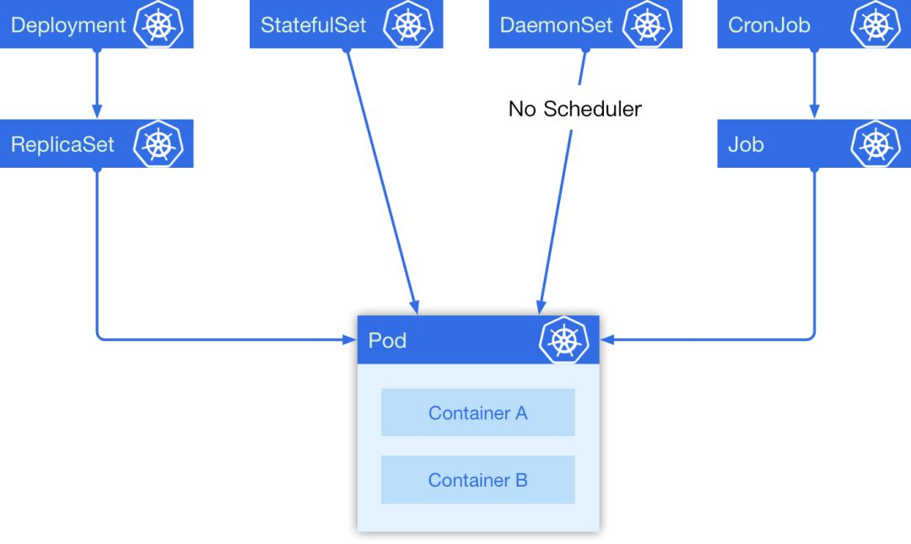
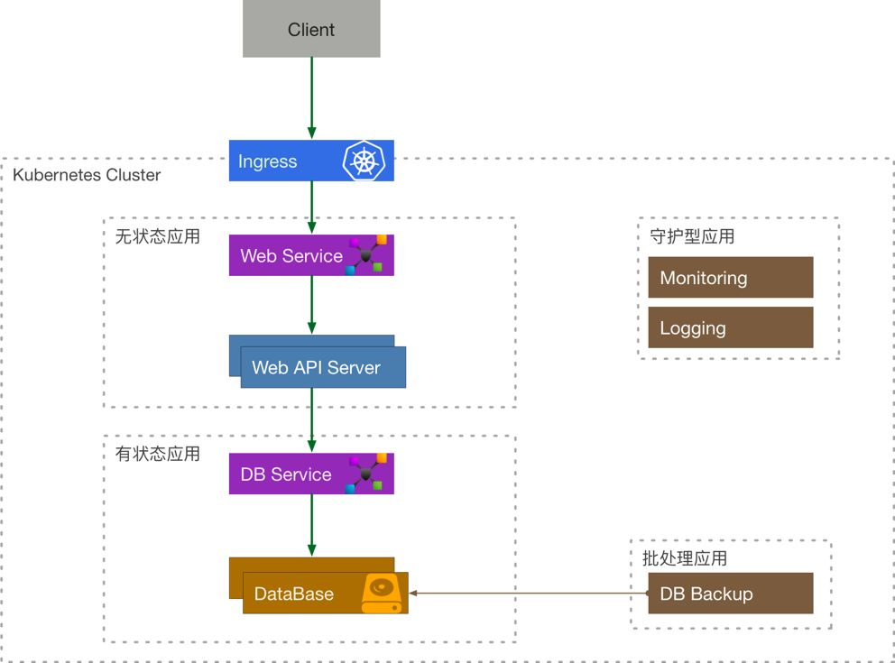

#### Arrange 编排

在容器环境中，编排通常涉及到三个方面:

1. 资源编排 - 负责资源的分配，如限制 namespace 的可用资源，scheduler 针对资源的不同调度策略； 

2. 工作负载编排 - 负责在资源之间共享工作负载，如 Kubernetes 通过不同的 controller 将 Pod 调度到合适的 node 上，并且负责管理它们的生命周期；

3. 服务编排 - 负责服务发现和高可用等，如 Kubernetes 中可用通过 Service 来对内暴露服务，通过 Ingress 来对外暴露服务。

在 Kubernetes 中有 5 种我们经常会用到的控制器来帮助我们进行容器编排，它们分别是 Deployment, StatefulSet, DaemonSet, CronJob, Job。

在这 5 种常见资源中，Deployment 经常被作为无状态实例控制器使用,Deployment用于布置服务;
 StatefulSet 是一个有状态实例控制器,Statefulset用于带状态的服务，数据库或者需要存储的; 
 DaemonSet 可以指定在选定的 Node 上跑，每个 Node 上会跑一个副本，它有一个特点是它的 Pod 的调度不经过调度器，在 Pod 创建的时候就直接绑定 NodeName,Daemonset 是类似守护进程的资源；
最后一个是定时任务，它是一个上级控制器，和 Deployment 有些类似，当一个定时任务触发的时候，它会去创建一个 Job ，具体的任务实际上是由 Job 来负责执行的,cronjob就是定时调度的资源。

他们之间的关系如下图：

因而k8s的集群编排被分为四种：

* 无状态应用 = Services + Volumes + Deployment;
* 有状态应用 = Services + Volumes + StatefulSet;
* 守护型应用 = Services + Volumes + DaemonSet;
* 批处理应用 = Services + Volumes + CronJob/Job ;

我们可以来考虑下一个简单的例子，一个需要使用到数据库的 API 服务在 Kubernetes 中应该如何表示: 

客户端程序通过 Ingress 来访问到内部的 API Service, API Service 将流量导流到 API Server Deployment 管理的其中一个 Pod 中，这个 Server 还需要访问数据库服务，它通过 DB Service 来访问 DataBase StatefulSet 的有状态副本。由定时任务 CronJob 来定期备份数据库，通过 DaemonSet 的 Logging 来采集日志，Monitoring 来负责收集监控指标。

License
This is free software distributed under the terms of the MIT license
