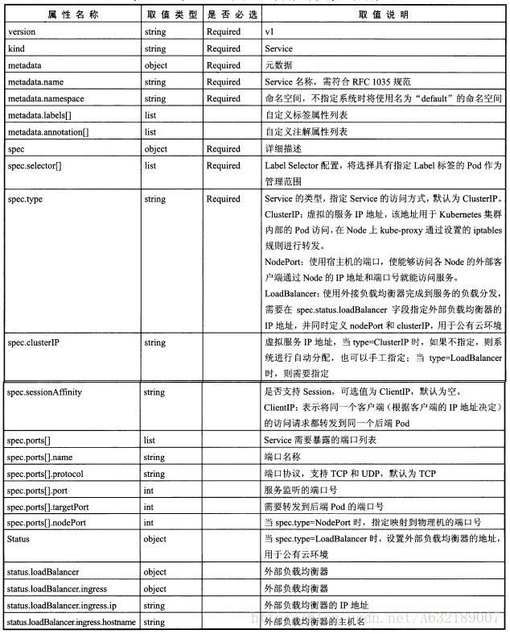
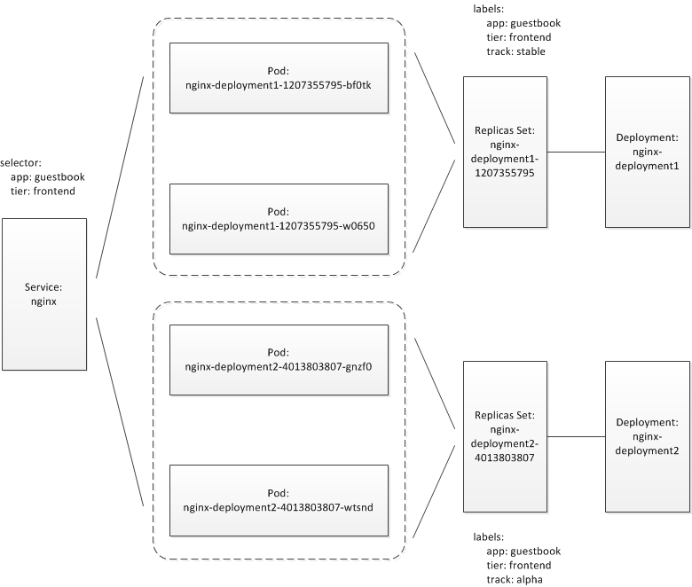

#### Services
Services是kubernetes最核心的概念，通过创建Service，可以为一组具有相同功能的容器应用提供一个统一的入口地址，并且将请求进行负载分发到后端的各个容器应用上。

Services特征是：

* 拥有唯一名字
* 拥有虚拟IP(Cluster IP，Service IP或VIP)和端口号
* 提供某种远程服务能力
* 被映射到提供服务能力的一组容器

Service服务是一个虚拟概念，逻辑上代理后端pod。众所周知，pod生命周期短，状态不稳定，pod异常后新生成的pod ip会发生变化，之前pod的访问方式均不可达。

通过service对pod做代理，service有固定的ip和port，ip:port组合自动关联后端pod，即使pod发生改变，kubernetes内部更新这组关联关系，使得service能够匹配到新的pod。这样，通过service提供的固定ip，用户再也不用关心需要访问哪个pod，以及pod是否发生改变，大大提高了服务质量。如果pod使用rc创建了多个副本，那么service就能代理多个相同的pod，通过kube-proxy，实现负载均衡。

集群中每个Node节点都有一个组件kube-proxy，实际上是为service服务的，通过kube-proxy，实现流量从service到pod的转发，kube-proxy也可以实现简单的负载均衡功能。

kube-proxy代理模式：userspace方式。kube-proxy在节点上为每一个服务创建一个临时端口，service的IP:port过来的流量转发到这个临时端口上，kube-proxy会用内部的负载均衡机制（轮询），选择一个后端pod，然后建立iptables，把流量导入这个pod里面。

Service通过Socket通信的方式对外提供服务，每个Service都会有一个独立的Endpoint的IP和端口的访问点。

kubernetes正是通过Service(虚拟Cluster IP+Service Port)连接到指定的Service上，再通过kubernetes内建的负载均衡器和故障恢复机制，就可以不论后端多少服务进程，服务进程是否会发生故障而进行重新部署，都不会影响服务的正常调度，而服务在创建后就不会变化。


#### Service定义详解
Kubernetes中的服务（Service）是一个抽象的概念，它定义了包含多个Pod逻辑上的组，以及访问它遵从的策略。服务在独立的Pod之间建立了松散的耦合关系。
和Kubernetes其他对象一样，服务使用YAML或者JSON定义。通常服务通过LabelSelector来指定哪些Pod在集合中。

尽管每个Pod都有自己的独立IP，但是这些IP并不暴露给外部，只有通过服务才能将它们暴露出去。服务让你的应用可以和外部通讯。

有好几种方式实现，方法是设置ServiceSpec的type属性：

* ClusterIP（默认） 通过一个内部IP地址暴露服务，只能在集群内访问
* NodePort 使用NAT，通过与Node相同的出口暴露服务。通过<NodeIP>:<NodePort>在集群外访问Service。是ClusterIP的超集。
* LoadBalancer 创建一个外部负载均衡器，给服务分配一个固定的外部地址。是NodePort的超集
* ExternalName 使用externalName参数给服务起一个任意的名称，自动返回一个该名称的CNAME。需要版本V1.7及以上的kube-dns。


yaml格式的Service定义文件的完整内容：

```bash
apiVersion: v1
kind: Service
matadata:
  name: string
  namespace: string
  labels:
    - name: string
  annotations:
    - name: string
spec:
  selector: []
  type: string
  clusterIP: string
  sessionAffinity: string
  ports:
  - name: string
    protocol: string
    port: int
    targetPort: int
    nodePort: int
  status:
    loadBalancer:
      ingress:
        ip: string
        hostname: string
```
<p align="center">

</p>


#### 负载分发策略
目前kubernetes提供了两种负载分发策略：RoundRobin和SessionAffinity.

RoundRobin：轮询模式，即轮询将请求转发到后端的各个Pod上.

SessionAffinity：基于客户端IP地址进行会话保持的模式，第一次客户端访问后端某个Pod，之后的请求都转发到这个Pod上.

默认是RoundRobin模式.

在某些场景中，开发人员希望自己控制负载均衡的策略，不使用Service提供的默认负载，kubernetes通过Headless Service的概念来实现。不给Service设置ClusterIP（无入口IP地址）：

```bash
apiVersion: v1
kind: Service
metadata:
  name: nginx
  labels:
    app: nginx
spec:
  ports:
  - port: 80
  clusterIP: None
  selector:
    app: nginx
```

有时候，一个容器应用提供多个端口服务：

```bash
apiVersion: v1
kind: Service
metadata:
  name: webapp
spec:
  ports:
  - port: 8080
    targetPort: 8080
    name: web
  - port: 8005
    targetPort: 8005
    name: management
  selector:
    app: webapp
```
为不同的应用分配各自的端口。

另一个例子是两个端口使用了不同的4层协议，即TCP或UDP.

```bash
apiVersion: v1
kind: Service
metadata:
  name: kube-dns
  namespace: kube-system
  labels:
    k8s-app: kube-dns
    kubernetes.io/cluster-service: "true"
    kubernetes.io/name: "KubeDNS"
spec:
  selector:
    k8s-app: kube-dns
  clusterIP: 169.169.0.100
  ports:
  - name: dns
    port: 53
    protocol: UDP
  - name: dns-tcp
    port: 53
    protocol: TCP
```

#### 集群外部访问Pod或Service
为了让外部客户端可以访问这些服务，可以将Pod或者Service的端口号映射到宿主主机，使得客户端应用能够通过物理机访问容器应用。

将容器应用的端口号映射到物理机.通过设置容器级别的hostPort，将容器应用的端口号映射到物理机上：

pod-hostport.yaml：

```bash
apiVersion: v1
kind: Pod
metadata:
  name: webapp
  labels:
    app: webapp
spec:
  containers:
  - name: webapp
    image: tomcat
    ports:
    - containerPort: 8080
      hostPort:8081
```

通过kubectl create创建这个Pod：
```bash
> kubectl create -f pod-hostport.yaml
```
通过物理机的IP地址和8081端口号访问Pod内的容器服务：

```bash
> curl 10.0.11.151:8081
```
#### 通过设置Pod级别的hostNetwork=true
通过设置Pod级别的hostNetwork=true，该Pod中所有容器的端口号都将被直接映射到物理机上，设置hostWork=true是需要注意，在容器的ports定义部分如果不指定hostPort，则默认hostPort等于containerPort，如果指定了hostPort，则hostPort必须等于containerPort的值。

pod-hostnetwork.yaml：
```bash
apiVersion: v1
kind: Pod
metadata:
  name: webapp
  labels:
    app: webapp
spec:
  hostNetwork: true
  containers:
  - name: webapp
    image: tomcat
    imagePullPolicy: Never
    ports:
    - containerPort: 8080
```
创建这个Pod：
```bash
> kubectl create -f pod-hostnetwork.yaml
```

通过物理机的IP地址和8080端口访问Pod的容器服务：
```bash
> curl 10.0.11.151:8080
```
#### 将Service的端口号映射到物理机

通过设置nodePort映射到物理机，同时设置Service的类型为NodePort：

webapp-svc-nodeport.yaml：
```bash
apiVersion: v1
kind: Service
metadata:
  name: webapp
spec:
  type: NodePort
  ports:
  - port: 8080
    targetPort: 8080
    nodePort: 8081
  selector:
    app: webapp
```
创建这个Service：
```bash
> kubectl create -f webapp-svc-nodeport.yaml
```

通过物理机的IP和端口访问：
```bash
> curl 10.0.11.151:8081
```
如果访问不通，查看下物理机的防火墙设置。同样，对该Service的访问也将被负载分发到后端多个Pod上.


#### Kubernetes集群中Service的滚动更新

传统的升级更新，是先将服务全部下线，业务停止后再更新版本和配置，然后重新启动并提供服务。这样的模式已经完全不能满足“时代的需要”了。在并发化、高可用系统普及的今天，服务的升级更新至少要做到“业务不中断”。而滚动更新(Rolling-update)恰是满足这一需求的一种系统更新升级方案。

对于在Kubernetes集群部署的Service来说，Rolling update就是指一次仅更新一个Pod，并逐个进行更新，而不是在同一时刻将该Service下面的所有Pod shutdown，避免将业务中断的尴尬。

#### Service、Deployment、Replica Set、Replication Controllers和Pod之间的关系

对于我们要部署的Application来说，一般是由多个抽象的Service组成。在Kubernetes中，一个Service通过label selector match出一个Pods集合，这些Pods作为Service的endpoint，是真正承载业务的实体。而Pod在集群内的部署、调度、副本数保持则是通过Deployment或ReplicationControllers这些高level的抽象来管理的，下面是一幅示意图：

<p align="center">

</p>

新版本的Kubernetes推荐用Deployment替代ReplicationController，在Deployment这个概念下在保持Pod副本数上实际发挥作用的是隐藏在背后的Replica Set。

因此，我们可以看到Kubernetes上Service的rolling update实质上是对Service所match出来的Pod集合的Rolling update，而控制Pod部署、调度和副本调度的却又恰恰是Deployment和replication controller，因此后两者才是kubernetes service rolling update真正要面对的实体。

#### kubectl rolling-update子命令

kubernetes在kubectl cli工具中仅提供了对Replication Controller的rolling-update支持，通过kubectl -help，我们可以查看到下面的命令usage描述：

```bash
> kubectl -help
... ...
Deploy Commands:
  rollout        Manage a deployment rollout
  rolling-update Perform a rolling update of the given ReplicationController
  scale          Set a new size for a Deployment, ReplicaSet, Replication Controller, or Job
  autoscale      Auto-scale a Deployment, ReplicaSet, or ReplicationController
... ...

> kubectl help rolling-update
... ...
Usage:
  kubectl rolling-update OLD_CONTROLLER_NAME ([NEW_CONTROLLER_NAME] --image=NEW_CONTAINER_IMAGE | -f
NEW_CONTROLLER_SPEC) [options]
... ...
```
现在来看一个例子，看一下kubectl rolling-update是如何对service下的Pods进行滚动更新的。我们的kubernetes集群有两个版本的Nginx：

```bash
> docker images|grep nginx
nginx                                                    1.11.9                     cc1b61406712        2 weeks ago         181.8 MB
nginx                                                    1.10.1                     bf2b4c2d7bf5        4 months ago        180.7 MB
```

例子中我们将Service的Pod从nginx 1.10.1版本滚动升级到1.11.9版本。
我们的rc-demo-v0.1.yaml文件内容如下：
```bash
apiVersion: v1
kind: ReplicationController
metadata:
  name: rc-demo-nginx-v0.1
spec:
  replicas: 4
  selector:
    app: rc-demo-nginx
    ver: v0.1
  template:
    metadata:
      labels:
        app: rc-demo-nginx
        ver: v0.1
    spec:
      containers:
        - name: rc-demo-nginx
          image: nginx:1.10.1
          ports:
            - containerPort: 80
              protocol: TCP
          env:
            - name: RC_DEMO_VER
              value: v0.1
```
创建这个replication controller：

```bash
> kubectl create -f rc-demo-v0.1.yaml
replicationcontroller "rc-demo-nginx-v0.1" created

> kubectl get pods -o wide
NAME                       READY     STATUS    RESTARTS   AGE       IP             NODE
rc-demo-nginx-v0.1-2p7v0   1/1       Running   0          1m        172.30.192.9   iz2ze39jeyizepdxhwqci6z
rc-demo-nginx-v0.1-9pk3t   1/1       Running   0          1m        172.30.192.8   iz2ze39jeyizepdxhwqci6z
rc-demo-nginx-v0.1-hm6b9   1/1       Running   0          1m        172.30.0.9     iz25beglnhtz
rc-demo-nginx-v0.1-vbxpl   1/1       Running   0          1m        172.30.0.10    iz25beglnhtz
```

Service manifest文件rc-demo-svc.yaml的内容如下：
```bash
apiVersion: v1
kind: Service
metadata:
  name: rc-demo-svc
spec:
  ports:
  - port: 80
    protocol: TCP
  selector:
    app: rc-demo-nginx
```

创建这个service：
```bash
> kubectl create -f rc-demo-svc.yaml
service "rc-demo-svc" created

> kubectl describe svc/rc-demo-svc
Name:            rc-demo-svc
Namespace:        default
Labels:            <none>
Selector:        app=rc-demo-nginx
Type:            ClusterIP
IP:            10.96.172.246
Port:            <unset>    80/TCP
Endpoints:        172.30.0.10:80,172.30.0.9:80,172.30.192.8:80 + 1 more...
Session Affinity:    None
No events.
```

可以看到之前replication controller创建的4个Pod都被置于rc-demo-svc这个service的下面了，我们来访问一下该服务：
```bash
> curl -I http://10.96.172.246:80
HTTP/1.1 200 OK
Server: nginx/1.10.1
Date: Wed, 08 Feb 2017 08:45:19 GMT
Content-Type: text/html
Content-Length: 612
Last-Modified: Tue, 31 May 2016 14:17:02 GMT
Connection: keep-alive
ETag: "574d9cde-264"
Accept-Ranges: bytes

> kubectl exec rc-demo-nginx-v0.1-2p7v0  env
... ...
RC_DEMO_VER=v0.1
... ...

```
通过Response Header中的Server字段，我们可以看到当前Service pods中的nginx版本为1.10.1；通过打印Pod中环境变量，得到RC_DEMO_VER=v0.1。

接下来，我们来rolling-update rc-demo-nginx-v0.1这个rc，我们的新rc manifest文件rc-demo-v0.2.yaml内容如下：

```bash
apiVersion: v1
kind: ReplicationController
metadata:
  name: rc-demo-nginx-v0.2
spec:
  replicas: 4
  selector:
    app: rc-demo-nginx
    ver: v0.2
  template:
    metadata:
      labels:
        app: rc-demo-nginx
        ver: v0.2
    spec:
      containers:
        - name: rc-demo-nginx
          image: nginx:1.11.9
          ports:
            - containerPort: 80
              protocol: TCP
          env:
            - name: RC_DEMO_VER
              value: v0.2
```

rc-demo-new.yaml与rc-demo-old.yaml有几点不同：rc的name、image的版本以及RC_DEMO_VER这个环境变量的值：

```bash
> diff rc-demo-v0.2.yaml rc-demo-v0.1.yaml
4c4
<   name: rc-demo-nginx-v0.2
---
>   name: rc-demo-nginx-v0.1
9c9
<     ver: v0.2
---
>     ver: v0.1
14c14
<         ver: v0.2
---
>         ver: v0.1
18c18
<           image: nginx:1.11.9
---
>           image: nginx:1.10.1
24c24
<               value: v0.2
---
>               value: v0.1
```
我们开始rolling-update，为了便于跟踪update过程，这里将update-period设为10s，即每隔10s更新一个Pod：
```bash
>  kubectl rolling-update rc-demo-nginx-v0.1 --update-period=10s -f rc-demo-v0.2.yaml
Created rc-demo-nginx-v0.2
Scaling up rc-demo-nginx-v0.2 from 0 to 4, scaling down rc-demo-nginx-v0.1 from 4 to 0 (keep 4 pods available, don't exceed 5 pods)
Scaling rc-demo-nginx-v0.2 up to 1
Scaling rc-demo-nginx-v0.1 down to 3
Scaling rc-demo-nginx-v0.2 up to 2
Scaling rc-demo-nginx-v0.1 down to 2
Scaling rc-demo-nginx-v0.2 up to 3
Scaling rc-demo-nginx-v0.1 down to 1
Scaling rc-demo-nginx-v0.2 up to 4
Scaling rc-demo-nginx-v0.1 down to 0
Update succeeded. Deleting rc-demo-nginx-v0.1
replicationcontroller "rc-demo-nginx-v0.1" rolling updated to "rc-demo-nginx-v0.2"
```

从日志可以看出：kubectl rolling-update逐渐增加 rc-demo-nginx-v0.2的scale并同时逐渐减小 rc-demo-nginx-v0.1的scale值直至减到0。

在升级过程中，我们不断访问rc-demo-svc，可以看到新旧Pod版本共存的状态，服务并未中断：

```bash
> curl -I http://10.96.172.246:80
HTTP/1.1 200 OK
Server: nginx/1.10.1
... ...

> curl -I http://10.96.172.246:80
HTTP/1.1 200 OK
Server: nginx/1.11.9
... ...

> curl -I http://10.96.172.246:80
HTTP/1.1 200 OK
Server: nginx/1.10.1
... ...
```
更新后的一些状态信息：


````bash
> kubectl get rc
NAME                 DESIRED   CURRENT   READY     AGE
rc-demo-nginx-v0.2   4         4         4         5m

> kubectl get pods
NAME                       READY     STATUS    RESTARTS   AGE
rc-demo-nginx-v0.2-25b15   1/1       Running   0          5m
rc-demo-nginx-v0.2-3jlpk   1/1       Running   0          5m
rc-demo-nginx-v0.2-lcnf9   1/1       Running   0          6m
rc-demo-nginx-v0.2-s7pkc   1/1       Running   0          5m

> kubectl exec rc-demo-nginx-v0.2-25b15  env
... ...
RC_DEMO_VER=v0.2
... ...
````

官方文档说kubectl rolling-update是由client side实现的rolling-update，这是因为roll-update的逻辑都是由kubectl发出N条命令到APIServer完成的，在kubectl的代码中我们可以看到这点：

```go
//https://github.com/kubernetes/kubernetes/blob/master/pkg/kubectl/cmd/rollingupdate.go
... ...
func RunRollingUpdate(f cmdutil.Factory, out io.Writer, cmd *cobra.Command, args []string, options *resource.FilenameOptions) error {
    ... ...
    err = updater.Update(config)
    if err != nil {
        return err
    }
    ... ...
}

//https://github.com/kubernetes/kubernetes/blob/master/pkg/kubectl/rolling_updater.go
func (r *RollingUpdater) Update(config *RollingUpdaterConfig) error {
    ... ...
    // Scale newRc and oldRc until newRc has the desired number of replicas and
    // oldRc has 0 replicas.
    progressDeadline := time.Now().UnixNano() + config.Timeout.Nanoseconds()
    for newRc.Spec.Replicas != desired || oldRc.Spec.Replicas != 0 {
        // Store the existing replica counts for progress timeout tracking.
        newReplicas := newRc.Spec.Replicas
        oldReplicas := oldRc.Spec.Replicas

        // Scale up as much as possible.
        scaledRc, err := r.scaleUp(newRc, oldRc, desired, maxSurge, maxUnavailable, scaleRetryParams, config)
        if err != nil {
            return err
        }
        newRc = scaledRc
    ... ...
}

```

在rolling_updater.go中Update方法使用一个for循环完成了逐步减少old rc的replicas和增加new rc的replicas的工作，直到new rc到达期望值，old rc的replicas变为0。

通过kubectl rolling-update实现的滚动更新有很多不足：
- 由kubectl实现，很可能因为网络原因导致update中断；
- 需要创建一个新的rc，名字与要更新的rc不能一样；虽然这个问题不大，但实施起来也蛮别扭的；
- 回滚还需要执行rolling-update，只是用的老版本的rc manifest文件；
- service执行的rolling-update在集群中没有记录，后续无法跟踪rolling-update历史。

不过，由于Replication Controller已被Deployment这个抽象概念所逐渐代替，下面我们来考虑如何实现Deployment的滚动更新以及deployment滚动更新的优势。

#### Deployment的rolling-update

kubernetes Deployment是一个更高级别的抽象，就像文章开头那幅示意图那样，Deployment会创建一个Replica Set，用来保证Deployment中Pod的副本数。由于kubectl rolling-update仅支持replication controllers，因此要想rolling-updata deployment中的Pod，你需要修改Deployment自己的manifest文件并应用。这个修改会创建一个新的Replica Set，在scale up这个Replica Set的Pod数的同时，减少原先的Replica Set的Pod数，直至zero。而这一切都发生在Server端，并不需要kubectl参与。

我们同样来看一个例子。我们建立第一个版本的deployment manifest文件：deployment-demo-v0.1.yaml。

````bash
apiVersion: extensions/v1beta1
kind: Deployment
metadata:
  name: deployment-demo
spec:
  replicas: 4
  selector:
    matchLabels:
      app: deployment-demo-nginx
  minReadySeconds: 10
  template:
    metadata:
      labels:
        app: deployment-demo-nginx
        version: v0.1
    spec:
      containers:
        - name: deployment-demo
          image: nginx:1.10.1
          ports:
            - containerPort: 80
              protocol: TCP
          env:
            - name: DEPLOYMENT_DEMO_VER
              value: v0.1
````

创建该deployment：

```bash
> kubectl create -f deployment-demo-v0.1.yaml --record
deployment "deployment-demo" created

> kubectl get deployments
NAME              DESIRED   CURRENT   UP-TO-DATE   AVAILABLE   AGE
deployment-demo   4         4         4            0           10s

> kubectl get rs
NAME                         DESIRED   CURRENT   READY     AGE
deployment-demo-1818355944   4         4         4         13s

> kubectl get pods -o wide
NAME                               READY     STATUS    RESTARTS   AGE       IP             NODE
deployment-demo-1818355944-78spp   1/1       Running   0          24s       172.30.0.10    iz25beglnhtz
deployment-demo-1818355944-7wvxk   1/1       Running   0          24s       172.30.0.9     iz25beglnhtz
deployment-demo-1818355944-hb8tt   1/1       Running   0          24s       172.30.192.9   iz2ze39jeyizepdxhwqci6z
deployment-demo-1818355944-jtxs2   1/1       Running   0          24s       172.30.192.8   iz2ze39jeyizepdxhwqci6z

> kubectl exec deployment-demo-1818355944-78spp env
... ...
DEPLOYMENT_DEMO_VER=v0.1
... ...
```

deployment-demo创建了ReplicaSet：deployment-demo-1818355944，用于保证Pod的副本数。

我们再来创建使用了该deployment中Pods的Service：
```bash
> kubectl create -f deployment-demo-svc.yaml
service "deployment-demo-svc" created

> kubectl get service
NAME                  CLUSTER-IP       EXTERNAL-IP   PORT(S)   AGE
deployment-demo-svc   10.109.173.225   <none>        80/TCP    5s
kubernetes            10.96.0.1        <none>        443/TCP   42d

> kubectl describe service/deployment-demo-svc
Name:            deployment-demo-svc
Namespace:        default
Labels:            <none>
Selector:        app=deployment-demo-nginx
Type:            ClusterIP
IP:            10.109.173.225
Port:            <unset>    80/TCP
Endpoints:        172.30.0.10:80,172.30.0.9:80,172.30.192.8:80 + 1 more...
Session Affinity:    None
No events.

> curl -I http://10.109.173.225:80
HTTP/1.1 200 OK
Server: nginx/1.10.1
... ...

```
好了，我们看到该service下有四个pods，Service提供的服务也运行正常。

接下来，我们对该Service进行更新。为了方便说明，我们建立了deployment-demo-v0.2.yaml文件，其实你也大可不必另创建文件，直接再上面的deployment-demo-v0.1.yaml文件中修改也行：

```bash
> diff deployment-demo-v0.2.yaml deployment-demo-v0.1.yaml
15c15
<         version: v0.2
---
>         version: v0.1
19c19
<           image: nginx:1.11.9
---
>           image: nginx:1.10.1
25c25
<               value: v0.2
---
>               value: v0.1
```
我们用deployment-demo-v0.2.yaml文件来更新之前创建的deployments中的Pods：

```bash
> kubectl apply -f deployment-demo-v0.2.yaml --record
deployment "deployment-demo" configured
```
apply命令是瞬间接收到apiserver返回的Response并结束的。但deployment的rolling-update过程还在进行：

```bash
> kubectl describe deployment deployment-demo
Name:            deployment-demo
... ...
Replicas:        2 updated | 4 total | 3 available | 2 unavailable
StrategyType:        RollingUpdate
MinReadySeconds:    10
RollingUpdateStrategy:    1 max unavailable, 1 max surge
Conditions:
  Type        Status    Reason
  ----        ------    ------
  Available     True    MinimumReplicasAvailable
OldReplicaSets:    deployment-demo-1818355944 (3/3 replicas created)
NewReplicaSet:    deployment-demo-2775967987 (2/2 replicas created)
Events:
  FirstSeen    LastSeen    Count    From                SubObjectPath    Type        Reason            Message
  ---------    --------    -----    ----                -------------    --------    ------            -------
  12m        12m        1    {deployment-controller }            Normal        ScalingReplicaSet    Scaled up replica set deployment-demo-1818355944 to 4
  11s        11s        1    {deployment-controller }            Normal        ScalingReplicaSet    Scaled up replica set deployment-demo-2775967987 to 1
  11s        11s        1    {deployment-controller }            Normal        ScalingReplicaSet    Scaled down replica set deployment-demo-1818355944 to 3
  11s        11s        1    {deployment-controller }            Normal        ScalingReplicaSet    Scaled up replica set deployment-demo-2775967987 to 2

> kubectl get pods
NAME                               READY     STATUS              RESTARTS   AGE
deployment-demo-1818355944-78spp   1/1       Terminating         0          12m
deployment-demo-1818355944-hb8tt   1/1       Terminating         0          12m
deployment-demo-1818355944-jtxs2   1/1       Running             0          12m
deployment-demo-2775967987-5s9qx   0/1       ContainerCreating   0          0s
deployment-demo-2775967987-lf5gw   1/1       Running             0          12s
deployment-demo-2775967987-lxbx8   1/1       Running             0          12s
deployment-demo-2775967987-pr0hl   0/1       ContainerCreating   0          0s

> kubectl get rs
NAME                         DESIRED   CURRENT   READY     AGE
deployment-demo-1818355944   1         1         1         12m
deployment-demo-2775967987   4         4         4         17s
```
我们可以看到这个update过程中ReplicaSet的变化，同时这个过程中服务并未中断，只是新旧版本短暂地交错提供服务：
```bash
> curl -I http://10.109.173.225:80
HTTP/1.1 200 OK
Server: nginx/1.11.9
... ...

> curl -I http://10.109.173.225:80
HTTP/1.1 200 OK
Server: nginx/1.10.1
... ...

> curl -I http://10.109.173.225:80
HTTP/1.1 200 OK
Server: nginx/1.10.1
... ...

```

最终所有Pod被替换为了v0.2版本：
```bash
> kubectl exec deployment-demo-2775967987-5s9qx env
... ...
DEPLOYMENT_DEMO_VER=v0.2
... ...

> curl -I http://10.109.173.225:80
HTTP/1.1 200 OK
Server: nginx/1.11.9
... ...
```
我们发现deployment的create和apply命令都带有一个–record参数，这是告诉apiserver记录update的历史。通过kubectl rollout history可以查看deployment的update history：
````bash
>  kubectl rollout history deployment deployment-demo
deployments "deployment-demo"
REVISION    CHANGE-CAUSE
1        kubectl create -f deployment-demo-v0.1.yaml --record
2        kubectl apply -f deployment-demo-v0.2.yaml --record
````
如果没有加“–record”，那么你得到的历史将会类似这样的结果：
```bash
> kubectl rollout history deployment deployment-demo
deployments "deployment-demo"
REVISION    CHANGE-CAUSE
1        <none>
```
同时，我们会看到old ReplicaSet并未被删除：

```bash
> kubectl get rs
NAME                         DESIRED   CURRENT   READY     AGE
deployment-demo-1818355944   0         0         0         25m
deployment-demo-2775967987   4         4         4         13m
```
这些信息都存储在server端，方便回退！
Deployment下Pod的回退操作异常简单，通过rollout undo即可完成。rollout undo会将Deployment回退到record中的上一个revision（见上面rollout history的输出中有revision列）：
```bash
> kubectl rollout undo deployment deployment-demo
deployment "deployment-demo" rolled back
```
rs的状态又颠倒回来：
```bash
> kubectl get rs
NAME                         DESIRED   CURRENT   READY     AGE
deployment-demo-1818355944   4         4         4         28m
deployment-demo-2775967987   0         0         0         15m
```

查看update历史:

```bash
> kubectl rollout history deployment deployment-demo
deployments "deployment-demo"
REVISION    CHANGE-CAUSE
2        kubectl apply -f deployment-demo-v0.2.yaml --record
3        kubectl create -f deployment-demo-v0.1.yaml --record
```
可以看到history中最多保存了两个revision记录（这个Revision保存的数量应该可以设置）。

##### 通过API实现的deployment rolling-update
我们的最终目标是通过API来实现service的rolling-update。Kubernetes提供了针对deployment的Restful API，包括：create、read、replace、delete、patch、rollback等。从这些API的字面意义上看，patch和rollback很可能符合我们的需要，我们需要验证一下。


我们将deployment置为v0.1版本，即：image: nginx:1.10.1，DEPLOYMENT_DEMO_VER=v0.1。然后我们尝试通过patch API将deployment升级为v0.2版本，由于patch API仅接收json格式的body内容，我们将 deployment-demo-v0.2.yaml转换为json格式：deployment-demo-v0.2.json。patch是局部更新，这里偷个懒儿，直接将全部deployment manifest内容发给了APIServer，让server自己做merge。

执行下面curl命令：
```bash
> curl -H 'Content-Type:application/strategic-merge-patch+json' -X PATCH --data @deployment-demo-v0.2.json http://localhost:8080/apis/extensions/v1beta1/namespaces/default/deployments/deployment-demo
```

这个命令输出一个merge后的Deployment json文件，由于内容太多，这里就不贴出来了，内容参见：patch-api-output.txt。


跟踪命令执行时的deployment状态，我们可以看到该命令生效了：新旧两个rs的Scale值在此消彼长，两个版本的Pod在交替提供服务。

```bash
> kubectl get rs
NAME                         DESIRED   CURRENT   READY     AGE
deployment-demo-1818355944   3         3         3         12h
deployment-demo-2775967987   2         2         2         12h

> curl  -I http://10.109.173.225:80
HTTP/1.1 200 OK
Server: nginx/1.10.1
... ...

> curl  -I http://10.109.173.225:80
HTTP/1.1 200 OK
Server: nginx/1.11.9
... ...

> curl  -I http://10.109.173.225:80
HTTP/1.1 200 OK
Server: nginx/1.10.1
... ...
```

不过通过这种方式update后，通过rollout history查看到的历史就有些“不那么精确了”：

```bash
> kubectl rollout history deployment deployment-demo
deployments "deployment-demo"
REVISION    CHANGE-CAUSE
8       kubectl create -f deployment-demo-v0.1.yaml --record
9        kubectl create -f deployment-demo-v0.1.yaml --record
```
目前尚无好的方法。但rolling update的确是ok了。

atch API支持三种类型的Content-type：json-patch+json、strategic-merge-patch+json和merge-patch+json。对于后面两种，从测试效果来看，都一样。但json-patch+json这种类型在测试的时候一直报错：

````bash
> curl -H 'Content-Type:application/json-patch+json' -X PATCH --data @deployment-demo-v0.2.json http://localhost:8080/apis/extensions/v1beta1/namespaces/default/deployments/deployment-demo
{
  "kind": "Status",
  "apiVersion": "v1",
  "metadata": {},
  "status": "Failure",
  "message": "json: cannot unmarshal object into Go value of type jsonpatch.Patch",
  "code": 500
}
````
kubectl patch子命令似乎使用的是strategic-merge-patch+json。源码中也没有过多说明三种方式的差别：
```go
//pkg/kubectl/cmd/patch.go
func getPatchedJSON(patchType api.PatchType, originalJS, patchJS []byte, obj runtime.Object) ([]byte, error) {
    switch patchType {
    case api.JSONPatchType:
        patchObj, err := jsonpatch.DecodePatch(patchJS)
        if err != nil {
            return nil, err
        }
        return patchObj.Apply(originalJS)

    case api.MergePatchType:
        return jsonpatch.MergePatch(originalJS, patchJS)

    case api.StrategicMergePatchType:
        return strategicpatch.StrategicMergePatchData(originalJS, patchJS, obj)

    default:
        // only here as a safety net - go-restful filters content-type
        return nil, fmt.Errorf("unknown Content-Type header for patch: %v", patchType)
    }
}

// DecodePatch decodes the passed JSON document as an RFC 6902 patch.

// MergePatch merges the patchData into the docData.

// StrategicMergePatch applies a strategic merge patch. The patch and the original document
// must be json encoded content. A patch can be created from an original and a modified document
// by calling CreateStrategicMergePatch.

```
接下来，我们使用deployment rollback API实现deployment的rollback。我们创建一个deployment-demo-rollback.json文件作为请求的内容
```go
{
        "name" : "deployment-demo",
        "rollbackTo" : {
                "revision" : 0
        }
}

```
revision:0 表示回退到上一个revision。执行下面命令实现rollback：
```bash
> curl -H 'Content-Type:application/json' -X POST --data @deployment-demo-rollback.json http://localhost:8080/apis/extensions/v1beta1/namespaces/default/deployments/deployment-demo/rollback
 {
   "kind": "Status",
   "apiVersion": "v1",
   "metadata": {},
   "status": "Failure",
   "message": "rollback request for deployment \"deployment-demo\" succeeded",
   "code": 200
 }
 
 # kubectl describe deployment/deployment-demo
 ... ...
 Events:
   FirstSeen    LastSeen    Count    From                SubObjectPath    Type        Reason            Message
   ---------    --------    -----    ----                -------------    --------    ------            -------
 ... ...
  27s        27s        1    {deployment-controller }            Normal        DeploymentRollback    Rolled back deployment "deployment-demo" to revision 1
 ... ...
```
通过查看deployment状态可以看出rollback成功了。但这个API的response似乎有些bug，明明是succeeded了(code:200)，但status却是”Failure”。

如果你在patch或rollback过程中还遇到什么其他问题，可以通过kubectl describe deployment/deployment-demo 查看输出的Events中是否有异常提示。

License
This is free software distributed under the terms of the MIT license
